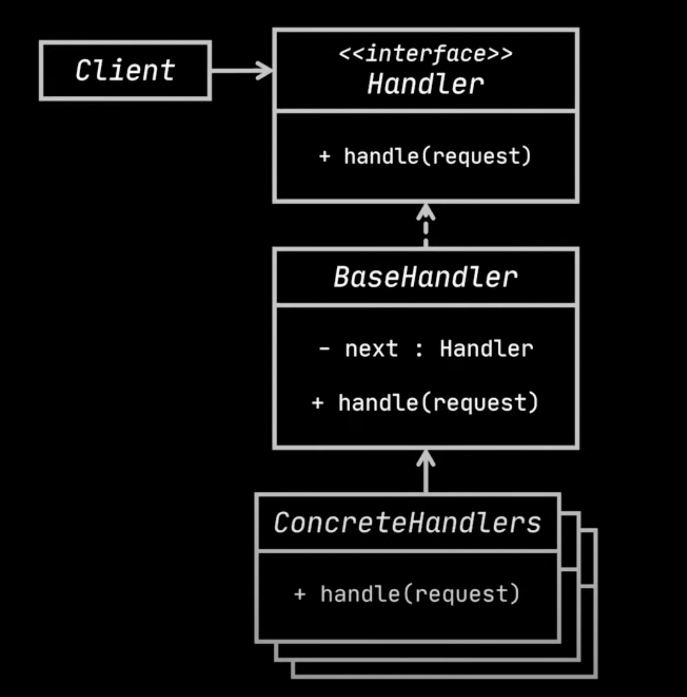

# Chain of responsibility

- The Chain of responsibility pattern transform particular behaviors into stand alone objects called handlers.
- The Chain of Responsibility allows an object to pass a request along a chain of handlers. 
- Each handler in the chain has the opportunity to process the request(optionally can pass to next handler) or pass it on to the next 
  handler in the chain.
- This pattern decouples the sender of a request from its receiver.
- `Components`
  - `Handler:` This is the base interface (or abstract class) that defines the operation (handle) for processing a request. 
  - `Concrete Handler:` These classes extend the Handler interface and implement the handle method with their specific processing 
    logic.
  - `setSuccessor:` This method (optional) allows a handler to define the next handler in the chain.
  - `Client:` This object initiates the request and sends it to the first object in the chain.
- `How it works`
  - `Operators or Concrete handlers`
    - Each operator is a concrete handler and can decide whether to pass the request further or not.
    - Operators contain actual code and are self-contained.
    - Operators usually are immutable. They accept all data at once through constructor.
  - `Handler`  
    - Operators implement the handler interface or BaseHandler class. 
    - Handler usually contains a single method for handling requests, typically named handleRequest.
    - Chaining next handler logic usually present inside the concrete handlers.
    - Sometimes, Handlers also contain an additional method for assigning next handler. This scenario occurs when client wants to 
        create a pipeline(chaining of handlers) by themselves.
    - `Base Handler`
    - If there is any boiler plate code that is common for all handlers, that can be written in this base handler abstract class.
  - `Client`
    - Client composes the chain of handlers.
    - This can be done once or dynamically depending on the application's business logic.
    - The request that client composes can be sent to any handler in the chain, not necessarily the first handler.
- Here is the UML class diagram.

  

- `Example`
  - Let's take a scenario of Customer care center request. The process starts with an ivr(robot), followed by a general executive and 
    then followed by request specific exective.
  - Another example is an authentication app. A user must pass several checks in an order.
    - Validate username to verify if user exists, Validate password and Validate permissions or roles to access something.
    - If not valid, the app has to redirect the user to sign-in again.
- Here is the sample code.
  
```java
//Base handler or interface
abstract class BaseHandler{
    private BaseHandler next;

    public BaseHandler setNextHandler(BaseHandler next){
        this.next = next;
        return this;
    }

    public abstract boolean handleRequest(String username, String password);

    protected boolean handleNext(String username, String password){
        if (Objects.nonNull(next)){
            return next.handleRequest(username, password);
        }
        return true;
    }
}

// Concrete handler implementations
class UserVerificationHandler extends BaseHandler{
    private Database database;

    public UserVerificationHandler(Database database){
        this.database = database;
    }

    @Override
    public boolean handleRequest(String username, String password) {
        if(!database.isValidUser(username)){
            // write error to log
            return false;
        }
        return handleNext(username, password);
    }
}

class PasswordVerificationHandler extends BaseHandler{
    private final Database database;

    public PasswordVerificationHandler(Database database){
        this.database = database;
    }

    @Override
    public boolean handleRequest(String username, String password) {
        if(!database.isValidPassword(username, password)){
            // write error to log and execute some custom logic
            System.out.println("Invalid password, returning to home page");
            return false;
        }
        return handleNext(username, password);
    }
}

class RoleVerificationHandler extends BaseHandler{

    @Override
    public boolean handleRequest(String username, String password) {
        if("admin".equals(username)){
            // Fetch specific permissions related to admin
            System.out.println("Loading admin page");
            return true;
        }
        System.out.println("loading home page");
        return true;
    }
}

// Client application
class AuthService {
    private BaseHandler handler;

    AuthService(BaseHandler handler){
        this.handler = handler;
    }

    public boolean login(String email, String password){
        if(handler.handleRequest(email, password)){
            // logic related to authenticated users
            return true;
        }
        return false;
    }


}

// Test class
public class Test {
    public static void main(String[] args) {
        Database db = new Database();
        BaseHandler handler = new UserVerificationHandler(db)
                .setNextHandler(new PasswordVerificationHandler(db)
                        .setNextHandler(new RoleVerificationHandler()));
        AuthService service = new AuthService(handler);
        service.login("admin", "admin"); // Loading admin page
        AuthService service2 = new AuthService(handler);
        service2.login("admin", "12345"); // Invalid password, returning to home page
    }
}

```
- `Benefits:`
  - `Decoupled Request Handling:` Objects don't need to know the exact handler responsible for their request. They simply send it to the first handler in the chain.
  - `Flexible Request Processing:` New handlers can be added without modifying existing code.
  - `Centralized Request Handling Logic:` Separates request handling logic from core object functionalities.
