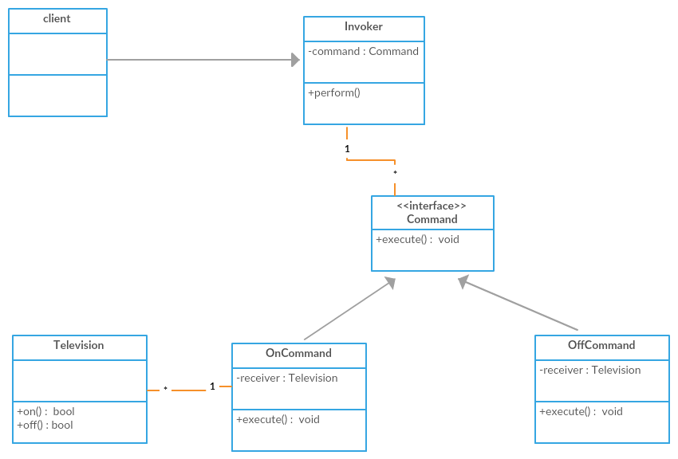

# Command design pattern
- The command pattern is a behavioral design pattern that encapsulates a request as an object.
- This object can then be passed around, stored, and executed at a later time.
- The command design pattern contains the following components.
  - `Command:` This is the core interface or abstract class that defines the execution logic for a specific request. 
    - Concrete command classes will implement this interface and provide specific functionalities.
  - `Receiver:` This is the object that actually performs the work when a command is executed. 
    - It can be any object that has a method corresponding to the request encapsulated in the command.
  - `Invoker:` This is the object that initiates the command execution. 
    - It doesn't know the specifics of the command itself, but knows how to invoke the execute method on the command object.
  - `Client:` This is the part of your code that creates concrete command objects and passes them to the invoker for execution.
- Let's see an example Tv and Remote control with On and Off command.
  - `Tv` is the receiver.
  - `Command` is the command
    - `OnCommand` and `OffCommand` are concrete implementations.
  - `RemoteControl` is the invoker.
  - `Person` is the client.
- Here is the UML for the command design pattern.


 
```java
//Receiver
public class Television {

    public void on(){
        System.out.println("Switching on TV");
    }
    
    public void off(){
        System.out.println("Switching off TV");
    }
}

//Command
public interface Command {
  void execute();
}

// Command implementations
public class OnCommand implements Command {

  private Television television;

  OnCommand(Television television){
    this.television = television;
  }

  @Override
  public void execute() {
    television.on();
  }
}

public class OffCommand implements Command {

  private Television television;

  OffCommand(Television television){
    this.television = television;
  }

  @Override
  public void execute() {
    television.off();
  }
}

// Invoker
public class RemoteControl {

  private Command command;

  public Command geCommand(){
    return command;
  }

  public void setCommand(Command command){
    this.command = command;
  }

  public void pressButton(){
    command.execute();
  }
}

// Client
public class Person {

  public static void main(String[] args) {
    Television television = new Television();
    Command onCommand = new OnCommand(television);
    RemoteControl remoteControl = new RemoteControl();
    remoteControl.setCommand(onCommand);
    remoteControl.pressButton();
  }
}
```
- Benefits
  - `Decoupling:` The command pattern decouples the object that initiates the request (invoker) from the object that 
    knows how to perform the action (receiver).
  - `Parameterization:` Commands can have parameters to specify details about the request. This allows for creating 
    commands with varying functionalities based on the provided data.
  - `Queueing:` Commands can be stored in a queue or other data structures and executed later. This is useful for 
    implementing undo/redo functionality, scheduling tasks, or batch processing operations.
  
- Other examples of Command design pattern.
  - `JDK:`
    - `java.lang.Runnable:` The Runnable interface in Java is a classic example of the Command Design Pattern.
      - It encapsulates a piece of code that can be executed asynchronously. The run() method acts as the command 
        to be executed.
    - `javax.swing.Action:` The Action interface in Java Swing is another example of the Command Design Pattern.
      - It encapsulates an action that can be triggered by a user interface component such as a button or menu item.
        - The `actionPerformed()` method acts as the command to be executed.
  - `Spring`
    - `org.springframework.batch.core.step.tasklet.Tasklet:` Each Tasklet implementation defines a single method 
      execute(), which acts as the command to be executed when the task or step is run.

- Difference between command and strategy
  - The Command Design Pattern focuses on encapsulating a request as an object and decoupling the sender of the 
    request from the receiver. 
  - The Strategy Design Pattern focuses on defining a family of algorithms, encapsulating each one as an object, 
    and allowing them to be interchanged dynamically.
