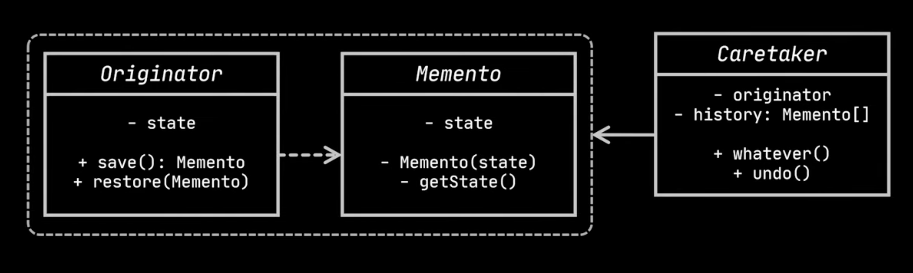

# Memento design pattern
- The memento design pattern allows to capture and restore the internal state of an object without revealing its implementation details
  (not violating encapsulation). 
- It's particularly useful for implementing undo/redo functionality or managing object states across different points in time.
- `Components`
  - `Memento Object:` 
    - The memento pattern introduces a special object called a memento. 
    - This object holds a snapshot of the originator's internal state at a specific point in time. 
    - The memento itself typically doesn't allow any modifications to the captured state to maintain data integrity.
  - `Originator:` 
    - The originator is the object whose state is being managed. 
    - It creates memento objects to capture its own state and provides an interface for the caretaker to interact with it.
  - `Caretaker:` 
    - The caretaker is responsible for storing and managing the memento objects. 
    - It doesn't interact directly with the originator's internal state, but relies on the originator to create mementos and potentially restore its state from them.
- `Benefits`
  - `Undo/Redo Functionality:` Memento allows you to easily implement undo/redo operations by keeping track of previous states 
    (mementos) and restoring the originator's state from them when needed.
  - `Encapsulation:` By using mementos, you can preserve the originator's internal state details while still allowing access to a 
    snapshot of that state for restoration purposes.
  - `State Management:` Memento provides a way to manage and store an object's state across different points in the application's 
    execution, which can be useful for implementing features like version control(git) or complex transactions.

## Example
- Let's consider a `text editor` to illustrate memento design pattern.
  - A text editor typically provides undo(Ctrl + Z) functionality.
    - Implementing this behavior involves taking snapshots of the text and save them as history(linked list).
    - In this example, snapshot needs to be taken and saved every time a new word is added to the text editor.
    - Later when the user undo what was written, the app needs to fetch the text from history and restore from it.

## Problem    
- Imagine, if the object we want to take snapshot might contains several fields like below, then we need to go through all fields 
  while taking snapshot.

 ```java
 class TextArea{
    private String text;
    private boolean bold;
    private boolean italic;
    private boolean underline;
    private Alignment alignment;
 }

 class Snapshot{
    private String text;
    private boolean bold;
    private boolean italic;
    private boolean underline;
    private Alignment alignment;
 }
 ```
- To take snapshot from all fields require fields of the TextArea to be public.
- Also, the snapshots are several objects of same class(Snapshot) and it has no methods, but contains only fields.
- To allow other objects to write and read data from snapshot, they need to be public or need to use setters.
- For this, Snapshot class needs to expose all of the original class(TextArea) fields irrespective of their access(private/protected/
  default). In otherwords, the Snapshot objects invade the space of TextArea objects instead of focusing on the actual action of taking snapshot.
- Other classes, heavily rely on every change made to the snapshot, which would break encapsulation.
 
## Solution
- Memento design pattern delegates creating the state snapshots to the actual owner of the state, instead of other objects trying to 
  copy the initial object's state from outside the class.
- The original class itself can make the snapshot since it has full access to its own state.
- Here is the implementation of this approach, using inner memento(or snapshot class). 

```java
class TextArea{
    private String text;
    public void setText(String text){
        this.text = text;
    }

    public String getContent() {
        return this.text;
    }

    public Memento takeSnapshot(){
        return new Memento(this.text);
    }

    public void restore(Memento memento){
        System.out.println("Retrieved text from memento is: " + memento.getSavedText());
        this.text = memento.getSavedText();
    }

    public static class Memento{
        private final String text;
        private Memento(String textToSave){
            text = textToSave;
        }

        private String getSavedText(){
            return text;
        }

    }
}
```
- `Note:` The memento class has same fields as that of the original class(TextArea) along with getter to retrieve the snapshot that is 
  only accessible from outer class.
- Let's implement the text editor which stores and retrieves the snapshots.
```java
class TextEditor {
    private Deque<Memento> stateHistory;
    private TextArea textArea;

    public TextEditor(){
        stateHistory = new LinkedList<>();
        textArea = new TextArea();
    }

    public void write(String text){
        //System.out.println("Writing text: " + text);
        textArea.setText(text);
        stateHistory.add(textArea.takeSnapshot());
    }

    public void undo(){
        stateHistory.removeLast();
        Memento memento = stateHistory.getLast();
        System.out.println("Undoing to previous state...");
        textArea.restore(memento);
    }

    public void showContent() {
        System.out.println("TextEditor: Current Content: " + textArea.getContent());
    }
}

class Test{
    public static void main(String[] args){
        TextEditor editor = new TextEditor();
        editor.write("Like");
        editor.showContent(); // TextEditor: Current Content: Like
        editor.write("Like and"); 
        editor.showContent(); // TextEditor: Current Content: Like and
        editor.write("Like and do");
        editor.showContent(); // TextEditor: Current Content: Like and do
        editor.undo(); // Undoing to previous state...
        // Retrieved text from memento is: Like and
        editor.showContent(); // TextEditor: Current Content: Like and
    }
}
```

- Here is the UML class diagram.



- `Components`
  - `Originator:` This is the `TextArea` class in the above example. 
    - This class can produce snapshots of its own class as well as restoring from snapshot when needed.
  - `Memento:` It's a value object acts as a snapshot of the `Originator` state.
    - It is a common practice to make memento immutable and pass data only once through constructor.
  - `CareTaker:` It is the `TextEditor` in the above example.
    - This class knows, when and why to capture originator's state and also responsible for restoring the orignator's state.
    - It keeps track of `Originators` history by storing list of mementos.   
- `Advantages`
  - This pattern makes full copies of an object's state including private fields and stores them in a seperate object.
  - This pattern delegates the creation of object's snapshot to the object itself. This makes the data safe as no other object can 
    read or access the snapshot data.

