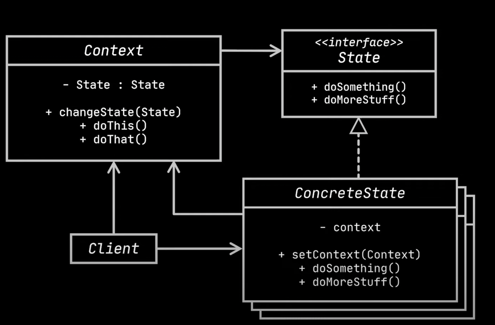

# State design pattern

- The state design pattern allows an object to change its behavior when its internal state changes.
- Let's take an example of a mobile device to explain this.
  - A mobile power button and home button.
  - The actions the power button perform vary based on the condition(state) in which the phone is in.
    - state1: When the phone is locked and display not on, pressing the power button turn the display on.
    - state2: when the phone display is on and locked, pressing the power button will unlock the phone.
    - state3: when the phone is unlocked, pressing the power button will lock the phone.
- At any given moment there are finite no of states. In every unique state, the program behaves differently.
- A state can switch the program to another one state or not switch at all.
- The switching rules(transitions) are predetermined and finite.
  - For ex, from display off state a phone can go in to Locked state.
  - From locked state a phone can go to unlocked state or power off state.
  - From unlocked state a phone can go to locked state or power off state.
- `Components`
  - `Context:` The object that changes states. In the above example, it is Phone.
    - This call holds the State object along with other methods as shown below.
  - `State` This is an interface (or abstract class) that defines the operations that can be performed on an object in a particular state. For ex, 
    clicking on home button and clicking on power button.
  - `Concrete State:` These are classes that implement the State interface and provide specific implementations for the operations based on the state 
    they represent. For ex, OffState(Display off), ReadyState, LockedState and PowerOffState.
      
```java
// context
class Phone{
    private State state;

    Phone(){
        state = new OffState(this);
    }

    public void setState(State state){
        this.state = state;
    }

    public void pressPowerButton(){
        state.onPowerButton();
    }

    public void pressHomeButton(){
        state.onHome();
    }
}

// state interface or abstract class
abstract class State{
        protected Phone phone;
        public State(Phone phone){
            this.phone = phone;
        }
    
        abstract void onHome();
        abstract void onPowerButton();
}

// concrete state classes
class OffState extends State{
    private Phone phone;
    public OffState(Phone phone){
        super(phone);
        this.phone = phone;
    }

    @Override
    public void onHome(){
        System.out.println("On home screen and locked");
        phone.setState(new LockedState(phone));
    }
 
    @Override 
    public void onPowerButton(){
        System.out.println("On home screen and locked");
        phone.setState(new LockedState(phone));
    }
}

class ReadyState extends State{
    public ReadyState(Phone phone){
        super(phone);
    }

    @Override
    public void onHome(){
        System.out.println("on home screen and ready to use");
    }
 
    @Override 
    public void onPowerButton(){
        System.out.println("In display off and locked state");
        phone.setState(new OffState(phone));
    }
}

class LockedState extends State{
    public LockedState(Phone phone){
        super(phone);
    }

    @Override
    public void onHome(){
        System.out.println("on home screen and unlocked state");
        phone.setState(new ReadyState(phone));
    }
 
    @Override 
    public void onPowerButton(){
        System.out.println("In display off and locked state");
        phone.setState(new OffState(phone));
    }
}

// Client test class
public class Test {
    public static void main(String[] args) {
        Phone phone = new Phone();
        phone.pressHomeButton(); //On home screen and locked
        phone.pressHomeButton(); //on home screen and unlocked state
        phone.pressPowerButton(); //In display off and locked state
        phone.pressPowerButton(); //On home screen and locked
        phone.pressPowerButton(); //In display off and locked state
        phone.pressHomeButton(); //On home screen and locked
        phone.pressHomeButton(); //on home screen and unlocked state
        phone.pressHomeButton(); //on home screen and ready to use
    }    
}
```
- Please see the below UML class diagram for state design pattern.



- `Summary:`
  - State pattern extracts each behavior to a seperate class and let the context delegate to the corresponding state class instead of primitive if-else 
    logic.
- Advantages
  - `Single Responsibility principle:` Each state is organized into a seperate class.
  - `Open-Closed Principle:` Ability to introduce new states without changing existing states.

## State vs Strategy

- Similarities
  - We can consider State is an extension of Strategy as both patterns are based on composition.
  - Both change the behavior of the context by delegating some work to helper objects.
- Differences
  - Though both change the behavior of the context, Concrete strategies are independent and unaware of each other, where as States are dependent and can 
    jump from one state to other.
  - Strategy pattern has multiple strategy implementations, but they all achieve same behavior. For ex, Differnt sorting strategies achieve sorting 
    behavior only, whereas State pattern is all about different behaviors depending on state.

## Example 2
- A vending machine that dispenses different items based on its current state.
- We can implement the State Pattern to represent the different states of the vending machine:
- Here is the code.

```java
// Context
class VendingMachine {
    private State state;

    public VendingMachine() {
        // Initial state is NoCoinState
        state = new NoCoinState(this);
    }

    public void setState(State state) {
        this.state = state;
    }

    // Delegate state-specific behavior to the current state object
    public void insertCoin() {
        state.insertCoin();
    }

    public void pressButton() {
        state.pressButton();
    }

    // Other methods...
}

// State interface
interface State {
    void insertCoin();
    void pressButton();
}

// Concrete state: NoCoinState
class NoCoinState implements State {
    private VendingMachine vendingMachine;

    public NoCoinState(VendingMachine vendingMachine) {
        this.vendingMachine = vendingMachine;
    }

    @Override
    public void insertCoin() {
        System.out.println("Coin inserted.");
        vendingMachine.setState(new HasCoinState(vendingMachine));
    }

    @Override
    public void pressButton() {
        System.out.println("Please insert a coin first.");
    }
}

// Concrete state: HasCoinState
class HasCoinState implements State {
    private VendingMachine vendingMachine;

    public HasCoinState(VendingMachine vendingMachine) {
        this.vendingMachine = vendingMachine;
    }

    @Override
    public void insertCoin() {
        System.out.println("You have already inserted a coin.");
    }

    @Override
    public void pressButton() {
        System.out.println("Item dispensed.");
        // Change state to NoCoinState after dispensing the item
        vendingMachine.setState(new NoCoinState(vendingMachine));
    }
}

// Client code
public class Main {
    public static void main(String[] args) {
        VendingMachine vendingMachine = new VendingMachine();
        vendingMachine.pressButton(); // Output: Please insert a coin first.

        vendingMachine.insertCoin(); // Output: Coin inserted.
        vendingMachine.pressButton(); // Output: Item dispensed.
    }
}
```

## Example 3
- A traffic light system functions differently based on its current signal.
- Implementing the traffic light system using brute force.
```java
public class TrafficLightBruteForce {
    private enum State {
        GREEN, YELLOW, RED
    }

    private State state;
    private State previousState;

    public TrafficLightBruteForce() {
        state = State.GREEN;
        previousState = State.RED; // Initially, we assume it turned green from red
    }

    public void change() {
        if (state == State.GREEN) {
            System.out.println("Green - Go!");
            previousState = state;
            state = State.YELLOW;
        } else if (state == State.YELLOW) {
            if (previousState == State.GREEN) {
                System.out.println("Yellow - Prepare to Stop!");
                state = State.RED;
            } else if (previousState == State.RED) {
                System.out.println("Yellow - Prepare to Go!");
                state = State.GREEN;
            }
        } else if (state == State.RED) {
            System.out.println("Red - Stop!");
            previousState = state;
            state = State.YELLOW;
        }
    }

    public static void main(String[] args) {
        TrafficLightBruteForce trafficLight = new TrafficLightBruteForce();
        trafficLight.change(); // Green - Go!
        trafficLight.change(); // Yellow - Prepare to Stop!
        trafficLight.change(); // Red - Stop!
        trafficLight.change(); // Yellow - Prepare to Go!
    }
}
```
- `Drawbacks with above approach`
  - Each time we want to add a new state, we have to add another if/else statement, which is not only confusing to read but also a nightmare to maintain, especially when we start to add || and && logic to our statements.
- `Solution`
  - State design pattern solves the above problem.  
  - Here is the sample code using state design pattern.
```java
/**
 * State
 */
interface TrafficLightState {
  void changeState(TrafficLight trafficLight);
}

/**
 * Concrete State
 */
class GreenState implements TrafficLightState {

  @Override
  public void changeState(TrafficLight light) {
    System.out.println("Green - go!");
    light.setState(new YellowState());
  }
}


/**
 * Concrete State
 */
class YellowState implements TrafficLightState {

  @Override
  public void changeState(TrafficLight light) {
    if (light.getPrevState() instanceof RedState) {
      System.out.println("Yellow (from Red to Green) - caution!");
      light.setState(new GreenState());
    } else {
      System.out.println("Yellow (from Green to Red) - caution!");
      light.setState(new RedState());
    }
  }
}

/**
 * Concrete State
 */
class RedState implements TrafficLightState {

  @Override
  public void changeState(TrafficLight light) {
    System.out.println("Red - Stop!");
    light.setState(new YellowState());
  }
}

/**
 * Context
 */

class TrafficLight {

  private TrafficLightState state;
  private TrafficLightState prevState;

  TrafficLight() {
    this.state = new RedState();
    this.prevState = null;
  }

  void setState(TrafficLightState state) {
    this.prevState = this.state;
    this.state = state;
  }

  TrafficLightState getPrevState() {
    return this.prevState;
  }

  void change() {
    this.state.changeState(this);
  }
}

/**
 * Client class
 */
public class Client {

  public static void main(String[] args) {
    TrafficLight lightSystem = new TrafficLight();

    lightSystem.change(); // Red - Stop!
    lightSystem.change(); // Yellow (from Red to Green) - caution!
    lightSystem.change(); // Green - go!
    lightSystem.change(); // Yellow (from Green to Red) - caution!
    lightSystem.change(); // Red - Stop!
    lightSystem.change(); // Yellow (from Red to Green) - caution!
    lightSystem.change(); // Green - go!
  }
}
```

- Here is the UML class diagram for the above.


