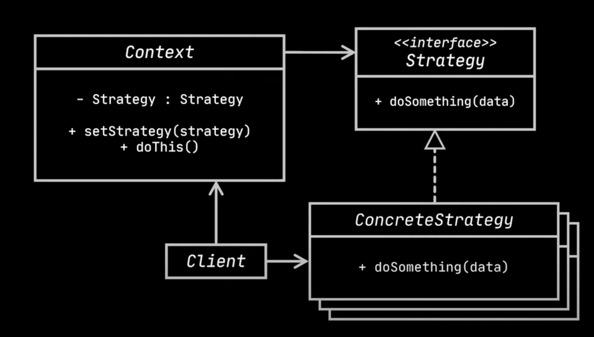

# Strategy design pattern
- `Problem`
  - Let's implement payment service to understand the need for strategy design pattern.

```java
class PaymentService{
    private int cost;
    private boolean includeDelivery;

    public void processPayment(String paymentMethod){
        CreditCard card = new CreditCard("cardNumber", "expiryDate", "cvv");
        System.out.println("Paying " + getTotal() + " using credit card");
        // process payment code goes here
    }

    private int getTotal(){
        return includeDelivery ? cost + 10: cost;
    }
}
```
  - If we want to add more payment methods like paypal, we need to wrap the above code with if else conditions as shown below.
```java
class PaymentService{
    private int cost;
    private boolean includeDelivery;

    public void processPayment(String paymentMethod){
        if("CreditCard".equals(paymentMethod)){
            CreditCard card = new CreditCard("cardNumber", "expiryDate", "cvv");
            // validate credit card
            System.out.println("Paying " + getTotal() + " using credit card");
            // process payment code goes here
        } else if("CreditCard".equals(paymentMethod)){
            String email = "...";
            String password = "....";
            // validate account
            System.out.println("Paying " + getTotal() + " using paypal");
            // process payment code goes here
        }
    }

    private int getTotal(){
        return includeDelivery ? cost + 10: cost;
    }
}
```
- The above approach has the following problems.
  - Single responsibility principle violation(Handling many types of payment)
  - Open/closed principle violation(Need to modify the existing code if more types of payments are added in the future).
- `Solution`
  - To fix the above problem we need strategy design pattern.
    - The strategy design pattern palces each payment method in its own class and making responsible for that payment strategy.
    - These classes are easily replaceable by one another.
- `Definition`
  - Strategy design pattern defines a family of algorithms, puts each of them in a seperate class, and makes their objects 
    interchangeable.
    - To make the objects interchangeable, extract the common behaviors(like collectPaymentDetails, validate, pay etc) to an interface.
  - Let's implement the strategy design pattern for the above payment service.
```java
interface PaymentStrategy {

    void collectPaymentDetails();

    boolean validatePaymentDetails();

    void pay(int amount);

}

class PaymentByCreditCard implements PaymentStrategy {

    private CreditCard card;

    @Override
    public void collectPaymentDetails() {
        // Pop-up to collect card details...
        card = new CreditCard("cardNumber", "expiryDate", "cvv");
        System.out.println("Collecting Card Details...");
    }

    @Override
    public boolean validatePaymentDetails() {
        // Validate credit card...
        System.out.println("Validating Card Info: " + card);
        return true;
    }

    @Override
    public void pay(int amount) {
        System.out.println("Paying " + amount + " using Credit Card");
        card.setAmount(card.getAmount() - amount);
    }

}

class PaymentByPayPal implements PaymentStrategy {

    private String email;
    private String password;

    @Override
    public void collectPaymentDetails() {
        // Pop-up to collect PayPal mail and password...
        email = "PayPal Mail";
        password = "PayPal Password";
        System.out.println("Collecting PayPal Account Details...");
    }

    @Override
    public boolean validatePaymentDetails() {
        // Validate account...
        System.out.printf("Validating PayPal Info: %s | %s%n", email, password);
        return true;
    }

    @Override
    public void pay(int amount) {
        System.out.println("Paying " + amount + " using PayPal");
    }

}

class CreditCard {
    private int amount = 1_000;
    private final String number;
    private final String date;
    private final String cvv;


    public CreditCard(String number, String date, String cvv) {
        this.number = number;
        this.date = date;
        this.cvv = cvv;
    }
    //setters and getters are omitted for breivity
}

class PaymentService {
    private int cost;
    private boolean includeDelivery = true;

    private PaymentStrategy strategy;

    public void processOrder(int cost) {
        this.cost = cost;
        strategy.collectPaymentDetails();
        if (strategy.validatePaymentDetails()) {
            strategy.pay(getTotal());
        }
    }

    private int getTotal() {
        return includeDelivery ? cost + 10 : cost;
    }

    public void setStrategy(PaymentStrategy strategy) {
        this.strategy = strategy;
    }
}

//Test code
public static void main(String[] args) {
        PaymentService paymentService = new PaymentService();
        // The strategy can now be easily picked at runtime
        paymentService.setStrategy(new PaymentByCreditCard());
        paymentService.processOrder(100);
        System.out.println("==========================================");
        paymentService.setStrategy(new PaymentByPayPal());
        paymentService.processOrder(100);
}
```
- `Note:` PaymentService class has no visibility on how the payment is conducted as it is making use of the strategy interface.
  Also, We can modify existing alogrithms and add new algorithms.
- Here is the UML class diagram of strategy design pattern.



- `Components`
  - `Context`
    - It maintains reference to one of the concrete strategies and communicates through that only via interface.
      - In out example, PaymentService class is the context which maintains reference to PaymentStrategy.
  - `Concrete Strategies`
    - These classes implement the specific type of strategy.
    - The context doesn't know how these concrete strategies are implemented.
    - In our example, PaymentByCreditCard, PaymentByPaypal represents concrete strategies.
  - `Client`
    - Client should create a specific type of strategy and pass it to context via setter method allowing clients to replace the 
      strategy during runtime.

## State vs Strategy

- Similarities
  - We can consider State is an extension of Strategy as both patterns are based on composition.
  - Both change the behavior of the context by delegating some work to helper objects.
- Differences
  - Though both change the behavior of the context, Concrete strategies are independent and unaware of each other, where as States are 
    dependent and can jump from one state to other.
  - Strategy pattern has multiple strategy implementations, but they all achieve same behavior. For ex, Differnt sorting strategies 
    achieve sorting behavior only, whereas State pattern is all about different behaviors depending on state.

## Strategy vs Java lambdas

- `Lambdas`
  - These are anonymous functions that can be used to implement functional interfaces, such as Runnable, Comparator, or custom 
    functional interfaces.
  - They provide a concise and inline way to define behavior without the need to create separate classes for each algorithm.
  - This can lead to more compact and readable code, especially for short and simple algorithms.
  - They reduce the amount of boilerplate code required for defining and using strategies.
  - They eliminate the need to create explicit strategy classes, interfaces, and implementations.

- `Differences`
  - `Flexibility:`
    - The Strategy Pattern offers more flexibility and extensibility, as it allows for a clear separation between the context/
      invoker and the strategies.
    - Lambda expressions offer flexibility, they are often used for simpler scenarios where strategies are shortlived or 
      straightforward.
  - `Abstraction Level:`
    - The Strategy Pattern works at a higher level of abstraction, with explicit strategy interfaces or classes representing 
      algorithms.
    - The Lambda functions operates at a lower level of abstraction, directly manipulating behavior through anonymous functions.
  - `Readability and Maintainability:`
    - The Strategy Pattern, with its explicit classes and interfaces, provides a more structured and self-documenting approach to 
      managing algorithms.
    - Excessive use of lambda expressions without proper context or documentation may reduce code readability and maintainability.

## Limitations and Pitfalls
- When a class has a behavior that can be realized in multiple ways, the use of the strategy pattern is a good candidate solution.
- `Limitations`
  - `Increased number of classes`
    - Every new strategy usually requires a new interface, which means it requires a new concrete strategy class.
  - `Over engineering`
    - It's tempting to use the strategy pattern wherever there's a hint of varying behavior, but sometimes a simpler solution like 
      conditional logic might be more appropriate.
    - Implementing the strategy pattern in places where it's not truly needed can make the design unnecessarily complex.  

## Use Cases
- `Payment Processing Systems` - any system where users can choose to pay with credit card, PayPal, Bitcoin etc.
- `Travel Routes` We can customize our routes when traveling. For example, we might choose a route without highways, the shortest route, 
  or the fastest route. Each of these routes have different strategies.
- `Shipping Options` - Each shipping method has its own category and its own strategy for determining cost and delivery time.  

# Assignment

- The below is an example of strategy which uses different filtering strategies like adult, married and senior citizen etc.

```java
class Person {
    private String lastName;
    private int age;
    private boolean isMarried;

    public Person(String lastName, int age, boolean isMarried) {
        this.lastName = lastName;
        this.age = age;
        this.isMarried = isMarried;
    }

    public String getLastName() {
        return lastName;
    }

    public int getAge() {
        return age;
    }

    public boolean isMarried() {
        return isMarried;
    }
}

interface PersonFilter {
    boolean apply(Person person);
}

class AdultFilter implements PersonFilter {
    public boolean apply(Person person){
        if(person.getAge() >= 18){
            return true;
        }
        return false;
    }
    // Implement Adult filter
}

class SeniorFilter implements PersonFilter {
    public boolean apply(Person person){
        if(person.getAge() >= 65){
            return true;
        }
        return false;
    }
    // Implement Senior filter
}

class MarriedFilter implements PersonFilter {
    public boolean apply(Person person){
        if(person.isMarried()){
            return true;
        }
        return false;
    }
    // Implement Married filter
}

class PeopleCounter {
    private PersonFilter filter;

    public void setFilter(PersonFilter filter) {
        this.filter = filter;
    }

    public int count(List<Person> people) {
        int count = 0;
        for(Person person: people){
            if(filter.apply(person)){
                count += 1;
            }
        }
        return count;
    }
}
//Test

class Main{
    public static void main(String[] args){
        List<Person> people = Arrays.asList(
        new Person("Doe", 20, false),
        new Person("Smith", 30, true),
        new Person("Old", 70, true)
        );

        PeopleCounter counter = new PeopleCounter();

        counter.setFilter(new AdultFilter());
        counter.count(people); // Adult count: 3

        counter.setFilter(new SeniorFilter());
        counter.count(people); // Senior count: 1

        counter.setFilter(new MarriedFilter());
        counter.count(people); // Married count: 2
    }
}
```
