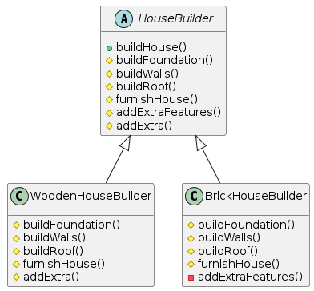

# Template method
- The Template Method is a behavioral design pattern that defines the skeleton of an algorithm in the superclass but lets subclasses 
  override specific steps of the algorithm without changing its structure.
- Steps to implement:
  - `Define the Template:` Create an abstract base class that defines the template method. This method outlines the algorithm's steps but 
    leaves the specific implementation of some steps to subclasses.
  - `Define Abstract Methods:`  Define abstract methods that represent the steps to be implemented by subclasses.
  - `Implement Concrete Subclasses:` Subclasses inherit from the abstract base class and provide concrete implementations for the abstract 
    methods to customize the behavior.
  - `Execute the Algorithm:` Call the template method, which executes algorithm by invoking the defined steps, including the overridden 
    methods in subclasses.
- Here is the example below:
```java
abstract class HouseBuilder {
    // Template method
    public final void buildHouse() {
        buildFoundation();
        buildWalls();
        buildRoof();
        furnishHouse();
        if (addExtraFeatures()) {
            addExtra();
        }
    }

    // These methods are abstract and must be implemented by subclasses
    protected abstract void buildFoundation();
    protected abstract void buildWalls();
    protected abstract void buildRoof();
    protected abstract void furnishHouse();

    // Hook method - subclasses can override this to add extra features
    protected boolean addExtraFeatures() {
        return true;
    }

    // This method is optional and can be overridden by subclasses to add extra features
    protected void addExtra() {
        System.out.println("Adding extra features");
    }
}

class WoodenHouseBuilder extends HouseBuilder {
    @Override
    protected void buildFoundation() {
        System.out.println("Building foundation with wood");
    }

    @Override
    protected void buildWalls() {
        System.out.println("Building walls with wood");
    }

    @Override
    protected void buildRoof() {
        System.out.println("Building roof with wood");
    }

    @Override
    protected void furnishHouse() {
        System.out.println("Furnishing wooden house");
    }

    @Override
    protected void addExtra() {
        System.out.println("Adding wooden deck");
    }
}

class BrickHouseBuilder extends HouseBuilder {
    @Override
    protected void buildFoundation() {
        System.out.println("Building foundation with bricks");
    }

    @Override
    protected void buildWalls() {
        System.out.println("Building walls with bricks");
    }

    @Override
    protected void buildRoof() {
        System.out.println("Building roof with tiles");
    }

    @Override
    protected void furnishHouse() {
        System.out.println("Furnishing brick house");
    }

    @Override
    protected boolean addExtraFeatures() {
        return false;
    }
}

public class Main {
    public static void main(String[] args) {
        System.out.println("Building wooden house:");
        HouseBuilder woodenHouseBuilder = new WoodenHouseBuilder();
        woodenHouseBuilder.buildHouse();

        System.out.println("\nBuilding brick house:");
        HouseBuilder brickHouseBuilder = new BrickHouseBuilder();
        brickHouseBuilder.buildHouse();
    }
}
```
- `Note:` The abstract class `buildHouse()` method is defined final. It defines steps that all subclasses should follow and cannot change 
  the behavior because it cannot be overridden.
- Here is the UML for the above code.



- Another example is JdbcTemplate.
  - JdbcTemplate doesn't define abstract methods in the traditional sense, but it allows for customization of specific parts of the 
    database operation process by accepting callbacks.
    - For example, it accepts implementations of the PreparedStatementCreator, PreparedStatementCallback, and RowCallbackHandler interfaces 
      to customize the creation of prepared statements, the processing of result sets.
    - We effectively provide concrete implementations of callback interfaces when you use methods like query(), update(), executeQuery().
    - These callbacks are invoked by the execute() method of JdbcTemplate, which orchestrates the overall database operation process.

```java
  // Example query
  String sql = "SELECT * FROM users WHERE age > ?";
  
  // Execute query using JdbcTemplate
  jdbcTemplate.query(sql, new Object[]{18}, (rs, rowNum) -> {
      // Process each row of the result set
      String name = rs.getString("name");
      int age = rs.getInt("age");
      System.out.println("Name: " + name + ", Age: " + age);
      return null;
  });
``` 
    
