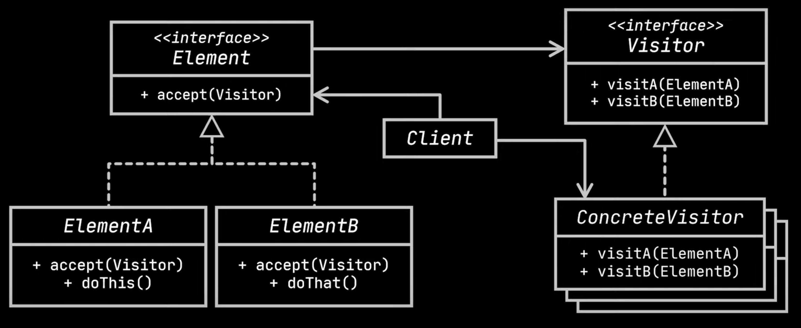

# Visitor design pattern

- The visitor design pattern adds new functionalities to a group of objects without modifying their classes. 
- It achieves this by introducing a separate visitor object that traverses the object structure and performs operations on each object 
  based on its type.
- `Components involved`
  - `Visitable:` This is an interface (or abstract class) that all the objects you want to be visited by the visitor implement. It declares 
    a method accept(Visitor visitor) that allows the object to accept a visitor.
  - `Visitor:` This is an interface (or abstract class) that defines the operations that can be performed on the visitable objects. It 
    declares a visit method for each concrete visitable class.
  - `ConcreteVisitor:` This implements the Visitor interface and provides specific implementations for the visit methods defined in the 
    Visitor interface. Each concrete visitor handles the visitable object based on its type.
- `Problem`
  - An insurance company has different kinds of clients say Company, Bank and Resident etc.
  - The clients share a few attributes we have created an abstract class Client and let all clients extend this as shown below.

```java
abstract class Client{
    private final String name;
    private final String address;
    private final String number;
}

class Resident extends Client{
    private final String insuranceClass;
    Resident(String name, String address, String number, String insuranceClass){
        super(name, address, number);
        this.insuranceClass = insuranceClass;
    }
}

class Company extends Client{
    private final int noOfEmployees;
    Company(String name, String address, String number, int noOfEmployees){
        super(name, address, number);
        this.noOfEmployees = noOfEmployees;
    }
}

class Bank extends Client{
    private final int banchesInsured;
    Bank(String name, String address, String number, int banchesInsured){
        super(name, address, number);
        this.banchesInsured = banchesInsured;
    }
}
```
- A new requirement to implement ad message functionality has arrived. This functionality sends an email based on the type of the client.
  - For ex, if it is a resident a medical insurance ad will be sent. For banks, theft insurance ad will be sent.
- This requirement seems simple using inheritance. Simply declare sendMail() method in the abstract class Client and let all the clients 
  implement the behaviors in their respective classes. With this approach writing a test class is simple as shown below.

```java
class Test{
    public static void main(String[] args){
        List<Client> clients = new ArrayList<>();
        // add all clients
        //send mails to all clients
        client.forEach(Client::sendEmail);
    }
}
```
- `Drawbacks`
  - Using polymorphism to invoke various clients looks so good. But, the above approach has the following drawbacks.
    - `Violation of SRP:` Concrete Client classes has started as simple POJO's and started adding functionality. More requirements in the 
      future violates this even further. If a change in the functionality is required, we need to change all sub classes code.

- `Solution`
  - From the above problem it is evident that there should be a way to take the functionality out of the concrete sub-classes.
  - Visitor pattern allows to seperate algorithms or behaviors from the objects on which they operate.
  - `Implementation`
    - Define a `visitor` interface with the operations that can be performed on the visitable objects.
    - Write a concrete visitor(s) that provides implementation to all visitor operations as shown in the below example.
```java
interface Visitor{
    void visitBank(Bank bank);
    void visitCompany(Company company);
    void visitResident(Resident resident);
}

class InsuranceMessagingVisitor implements Visitor{
    public void visitBank(Bank bank){
        System.out.println("Sending email about theft banking");
    }

    public void visitCompany(Company company){
        System.out.println("Sending email about equipment and safety");
    }

    public void visitResident(Resident resident){
        System.out.println("Sending email about medical insurance");
    }
}
```
- The client code to call the above methods as shown below has the below disadvantage especially when the types of clients grow large.
```java
for(Client client: clients){
    if(client instanceOf Bank){
        visitor.visitBank((Bank)client);
    } else if(client instanceOf Company){
        visitor.visitCompany((Company)client);
    } else if(client instanceOf Resident){
        visitor.visitResident((Resident)client);
    }
}
```
- Also, method over loading doesn't work. The below code won't compile and asks to subclass to one of it's subclasses.

```java
class InsuranceMessagingVisitor implements Visitor{
    for(Client client: clients){
        //won't compile
        visit(client);
    }

    public void visit(Bank bank){
        System.out.println("Sending email about theft banking");
    }

    public void visit(Company company){
        System.out.println("Sending email about equipment and safety");
    }

    public void visit(Resident resident){
        System.out.println("Sending email about medical insurance");
    }
}
```
- The Visitor design pattern uses an approach called Double dispatch to solve the above problem.
  - In this approach, since the objects know their type, the delegation to the proper method is chosen by the objects themselves.
  - It means each object accepts a visitor and choose which method to call.
  - Here is the complete implementation of visitor.
```java
interface Visitor{
    void visitBank(Bank bank);
    void visitCompany(Company company);
    void visitResident(Resident resident);
}

class InsuranceMessagingVisitor implements Visitor{
    public void visitBank(Bank bank){
        System.out.println("Sending email about theft banking");
    }

    public void visitCompany(Company company){
        System.out.println("Sending email about equipment and safety");
    }

    public void visitResident(Resident resident){
        System.out.println("Sending email about medical insurance");
    }
}

abstract class Client{
    private final String name;
    private final String address;
    private final String number;

    public abstract void accept(Visitor visitor);
}

class Resident extends Client{
    private final String insuranceClass;
    Client(String name, String address, String number, String insuranceClass){
        super(name, address, number);
        this.insuranceClass = insuranceClass;
    }

    @Override
    public void accept(Visitor visitor){
        visitor.visitResident(this)
    }
}

class Company extends Client{
    private final int noOfEmployees;
    Client(String name, String address, String number, int noOfEmployees){
        super(name, address, number);
        this.noOfEmployees = noOfEmployees;
    }

    @Override
    public void accept(Visitor visitor){
        visitor.visitCompany(this)
    }
}

class Bank extends Client{
    private final int banchesInsured;
    Client(String name, String address, String number, int banchesInsured){
        super(name, address, number);
        this.banchesInsured = banchesInsured;
    }

    @Override
    public void accept(Visitor visitor){
        visitor.visitBank(this)
    }
}
```   
- For dealing with a list of clients, code can also be written along side the visitor implementations as shown below.

```java
class InsuranceMessagingVisitor implements Visitor{
    public void sendInsuranceMails(List<Client> clients){
        for(Client client: clients){
                client.accept(this);
        }
    }
    public void visitBank(Bank bank){
        System.out.println("Sending email about theft banking");
    }

    public void visitCompany(Company company){
        System.out.println("Sending email about equipment and safety");
    }

    public void visitResident(Resident resident){
        System.out.println("Sending email about medical insurance");
    }
}
```
- Because all visiting behaviors are extracted to a common interface, we can introduce new concrete visitors without altering existing ones.
- Here is the UML class diagram of visitor design pattern.



- Advantages
  - Classes will be more focused on their job enforcing SRP, because this pattern isolates behaviors from objects and places them in a 
    single class.
  - It also enforces Open/Closed behavior, as new visiting behaviors can be easily implemented with new concrete Visitor implementations.
    These visitors are easily interchangeable in the client code.
- Drawbacks
  - `Increased complexity:` Introducing visitor objects can add complexity to the codebase, especially for simple operations.
  - `Performance overhead:` Method calls for visitor dispatching can introduce slight overhead compared to direct method calls.