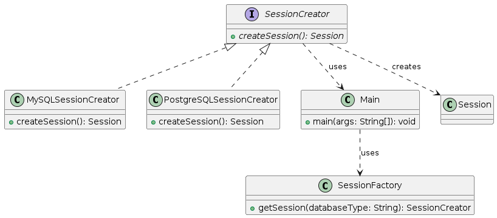

# Factory 
- Factory hides the object creation process.
- Factory provides a flexible approach to object creation.
- How it works
  - Defines an interface (or abstract class) for creating objects.
  - Subclasses of the factory implement this interface and decide which concrete class to instantiate.
  - The client code interacts with the factory, not the concrete classes themselves.
- Structure
  - Product: The interface or abstract class representing the objects to be created.
  - ConcreteProduct: Concrete classes implementing the Product and representing specific object types.
  - Creator (Factory): The interface (or abstract class) defining the object creation method.
  - ConcreteCreator (Factory): Subclasses of the Creator implementing the factory logic and deciding 
    which concrete product to create.
- Here is an example.
```java

// SessionFactory factory interface
interface SessionCreator {
    Session createSession();
}

// Concrete MySQLSessionFactoryCreator class
class MySQLSessionCreator implements SessionCreator {
    @Override
    public Session createSession() {
        // Hibernate configuration for MySQL
        StandardServiceRegistry registry = new StandardServiceRegistryBuilder()
                .configure("hibernate_mysql.cfg.xml")
                .build();
        return new MetadataSources(registry).buildMetadata().buildSessionFactory();
    }
}

// Concrete PostgreSQLSessionFactoryCreator class
class PostgreSQLSessionCreator implements SessionCreator {
    @Override
    public Session createSession() {
        // Hibernate configuration for PostgreSQL
        StandardServiceRegistry registry = new StandardServiceRegistryBuilder()
                .configure("hibernate_postgresql.cfg.xml")
                .build();
        return new MetadataSources(registry).buildMetadata().buildSessionFactory();
    }
}

// SessionFactory Factory
class SessionCreatorFactory {
    public static SessionCreator getSessionCreator(String databaseType) {
        switch (databaseType.toLowerCase()) {
            case "mysql":
                return new MySQLSessionCreator();
            case "postgresql":
                return new PostgreSQLSessionCreator();
            default:
                throw new IllegalArgumentException("Unsupported database type");
        }
    }
}

// Client code
public class Main {
    public static void main(String[] args) {
        // Creating SessionCreator using the factory
        SessionCreator sessionCreator = SessionCreatorFactory.getSessionCreator("mysql");
        Session mysqlSession = sessionCreator.createSession();
        
        // Use the mysqlSession to interact with MySQL database
        
        // Creating SessionCreator for PostgreSQL using the factory
        sessionCreator = SessionCreatorFactory.getSessionCreator("postgresql");
        Session postgresqlSession = sessionCreator.createSession();
        
        // Use the postgresqlSession to interact with PostgreSQL database
    }
}

```
- Here is the UML for the above code.



- Here is an example from Java API.
    - `DriverManager.getConnection(urlString)`, where DriverManager acts as a factory and provides an 
      instance of Connection based on url and provided driver jar in the classpath. i.e. it uses OracleDriver for Oracle db, MySqlDriver for mysql db etc to return the appropriate Connection object.