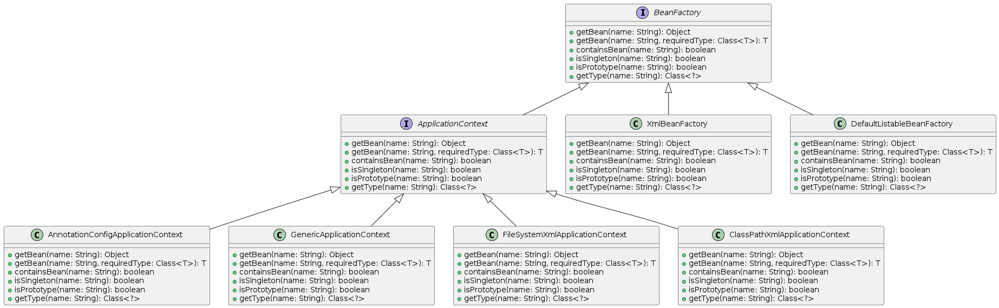

# Abstract Factory

- The Abstract Factory Design Pattern provides an interface for creating 
  families of related or dependent objects without specifying their concrete classes.
- Here is an example.
```java
// Abstract factory which contains related objects Document and Chart
public interface ContentFactory {
  Document createDocument(String type);
  Chart createChart(String type);
}

public interface Document{
    // methods omitted for brevity
}
public interface Chart{
    //methods omitted for brevity
}

//Family of different Document types can be written like below.
public class ReportDocument implements Document{}
public class InvoiceDocument implements Document{}

//Family of different Chart types can be written like below.
public class BarChart implements Chart{}
public class PieChart implements Chart{}


//Two types of factoires below. One for Reports and other for Invoice.
public class ReportFactory implements ContentFactory {

  @Override
  public Document createDocument(String type) {
    if (type.equals("REPORT")) {
      return new ReportDocument();
    } else {
      throw new IllegalArgumentException("Invalid document type");
    }
  }

  @Override
  public Chart createChart(String type) {
    if (type.equals("BAR")) {
      return new BarChart();
    } else {
      throw new IllegalArgumentException("Invalid chart type");
    }
  }
}

//
public class InvoiceFactory implements ContentFactory {

  @Override
  public Document createDocument(String type) {
    if (type.equals("INVOICE")) {
      return new InvoiceDocument();
    } else {
      throw new IllegalArgumentException("Invalid document type");
    }
  }

  @Override
  public Chart createChart(String type) {
    if (type.equals("PIE")) {  // Assuming invoices use pie charts
      return new PieChart();
    } else {
      throw new IllegalArgumentException("Invalid chart type");
    }
  }
}

public class Main {
  public static void main(String[] args) {
    ContentFactory factory = chooseFactory(); // Get the desired factory (e.g., ReportFactory)

    Document document = factory.createDocument("REPORT"); // Create a report
    document.setTitle("Sales Report");
    document.setContent("Monthly sales data...");
    document.save();

    Chart chart = factory.createChart("BAR"); // Create a bar chart
    chart.setData(List.of(10.0, 15.0, 20.0)); // Assuming data population logic
    chart.generateImage();
  }

  private static ContentFactory chooseFactory() {
    // Logic to determine and return the appropriate concrete factory (e.g., based on user selection)
  }
}
```
- Here is the UML for the above.


- Let's see another real use case in spring library.
  - Spring has BeanFactory and ApplicationContext family of interfaces.
  - These two are related. BeanFactory is super interface of 
    ApplicationContext.
    - For simple applications with minimal bean configuration, BeanFactory 
      might suffice.
    - For most enterprise applications that leverage Spring features like 
      dependency injection, internationalization, and event handling, ApplicationContext is the recommended approach.
  - There is no abstract factory interface defined in spring like the above `ContentFactory`, but `BeanFactory` and `ApplicationContext` provide two family of interfaces(factories) like Document and Chart.
- Here is the class diagram.



- There are multiple implementations of ApplicationContext for processing 
  annotation based configuration, classpath xml, file path xml etc. Similarly, there are multiple implementations for BeanFactory like XmlBeanFactory, DefaultListableBeanFactory etc.
