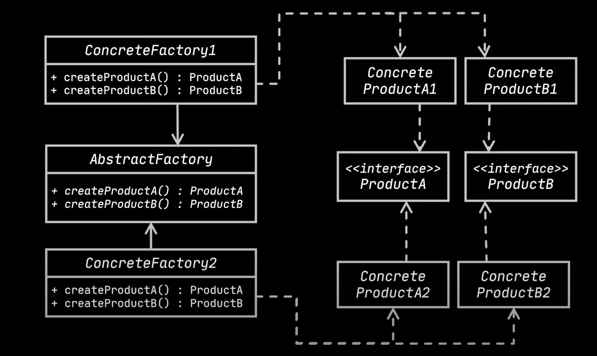
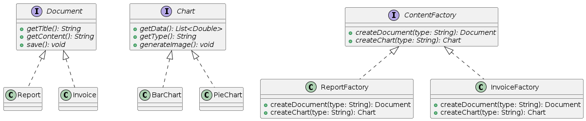

# Abstract Factory

- Abstract factory design pattern allows to create families of `realated objects` without specifying their concrete classes.
- To understand abstract factory let's take an example of a factory that makes computer GPUs.
  - Let's say these Gpus are manufactured by companies like MSI, ASUS etc.
```java
interface Gpu{
  void assemble();
}

class MsiGpu implements Gpu{

  @Override
  public void assemble(){
    System.out.println("Assembling Msi Gpu");
  }

}

class AsusGpu implements Gpu{

  @Override
  public void assemble(){
    System.out.println("Assembling Asus Gpu");
  }

}

abstract class Company{
  public Gpu assembleGpu(){
    Gpu gpu = createGpu();
    gpu.assemble();
    return gpu;
  }

  abstract Gpu createGpu();
}

class MSIManufacturer extends Company{
  @Override
  public Gpu createGpu(){
    return new MsiGpu();
  }
}

class AsusManufacturer extends Company{
  @Override
  public Gpu createGpu(){
    return new AsusGpu();
  }
}
```

## `Need for abstract factory`
- The above factory method approach works perfectly for Gpu manufacturing. If the company wants to manufacture monitors which are also 
  MSI and Asus branded, then the factory method pattern can be re-written with a generic component as shown below.
```java
interface Component{
  void assemble();
}

class MsiGpu implements Component{

  @Override
  public void assemble(){
    System.out.println("Assembling Msi Gpu");
  }

}

class AsusGpu implements Component{

  @Override
  public void assemble(){
    System.out.println("Assembling Asus Gpu");
  }

}

class MsiMonitor implements Component{

  @Override
  public void assemble(){
    System.out.println("Assembling Msi monitor");
  }

}

class AsusMonitor implements Component{

  @Override
  public void assemble(){
    System.out.println("Assembling Asus monitor");
  }

}


abstract class Company{
  public Component assembleComponent(String type){
    Component component = createComponent(type);
    component.assemble();
    return component;
  }

  abstract Gpu createComponent(String type);
}

class MSIManufacturer extends Company{
  @Override
  public Component createComponent(String type){
    if("Gpu".equals(type)){
      return new MsiGpu();
    } else {
      return new MsiMonitor();
    }
  }
}

class AsusManufacturer extends Company{
  @Override
    public Component createComponent(String type){
      if("Gpu".equals(type)){
      return new AsusGpu();
    } else {
      return new AsusMonitor();
    }
  }
}
```
- As we can see from the above the concrete companies have violated SRP and open/closed principles.
- In the above context, a single factory is not enough to achieve the given requirement. This requirement has the need of an abstract 
  factory.
- `How to implement`
  - An abstract factory recommends to implement separate interface for each distinct product.
  - Make the abstract factory declare multiple abstract methods, one for each type of product. In this example we have two products 
    monitor and gpu.
  - Each concrete factory needs to override all abstract methods of the factory.  

```java
interface Gpu{
  void assemble();
}

class MsiGpu implements Gpu{

  @Override
  public void assemble(){
    System.out.println("Assembling Msi Gpu");
  }

}

class AsusGpu implements Gpu{

  @Override
  public void assemble(){
    System.out.println("Assembling Asus Gpu");
  }

}

interface Monitor{
  void assemble();
}

class MsiMonitor implements Monitor{

  @Override
  public void assemble(){
    System.out.println("Assembling Msi monitor");
  }

}

class AsusMonitor implements Monitor{

  @Override
  public void assemble(){
    System.out.println("Assembling Asus monitor");
  }
}

abstract class Company{
  abstract Gpu createGpu();
  abstract Gpu createMonitor();
}

class MsiManufacturer extends Company{
  @Override
  public void createGpu(){
    return new MsiGpu();
  }

  @Override
  public void createMonitor(){
    return new MsiMonitor();
  }
}

class AsusManufacturer extends Company{
  @Override
  public void createGpu(){
    return new AsusGpu();
  }

  @Override
  public void createMonitor(){
    return new AsusMonitor();
  }
}
// Test
public static void main(String[] args){
  Company msi = new MsiManufacturer();
  Gpu gpu= msi.createGpu();
  gpu.assemble();

  Monitor monitor = msi.createMonitor();
  monitor.assemble();
}
```    
- The client code now works with any concrete factory as long as they can communicate with abstract interfaces.
- Here is the UML class diagram.



## `When to use`

- We should use abstract factory design pattern when the code needs to work with various families of related products, but don't want 
  to depend on the concrete classes of those products.
- The concrete classes might be known before hand, that's why many designs start with `factory method` design pattern and later evolve 
  into an abstract factory design pattern.
- Using this pattern we follow SRP and open/closed principles.

## Usecases

- Let's see another real use case in spring library.
  - Spring has BeanFactory and ApplicationContext family of interfaces.
  - These two are related. BeanFactory is super interface of ApplicationContext.
    - For simple applications with minimal bean configuration, BeanFactory might suffice.
    - For most enterprise applications that leverage Spring features like dependency injection, internationalization, and event 
      handling, ApplicationContext is the recommended approach.
  - There is no abstract factory interface defined in spring like the above `ContentFactory`, but `BeanFactory` and   
    `ApplicationContext` provide two family of interfaces(factories) like Document and Chart.
- Here is the class diagram.



- There are multiple implementations of ApplicationContext for processing annotation based configuration, classpath xml, file path xml 
  etc. Similarly, there are multiple implementations for BeanFactory like XmlBeanFactory, DefaultListableBeanFactory etc.
