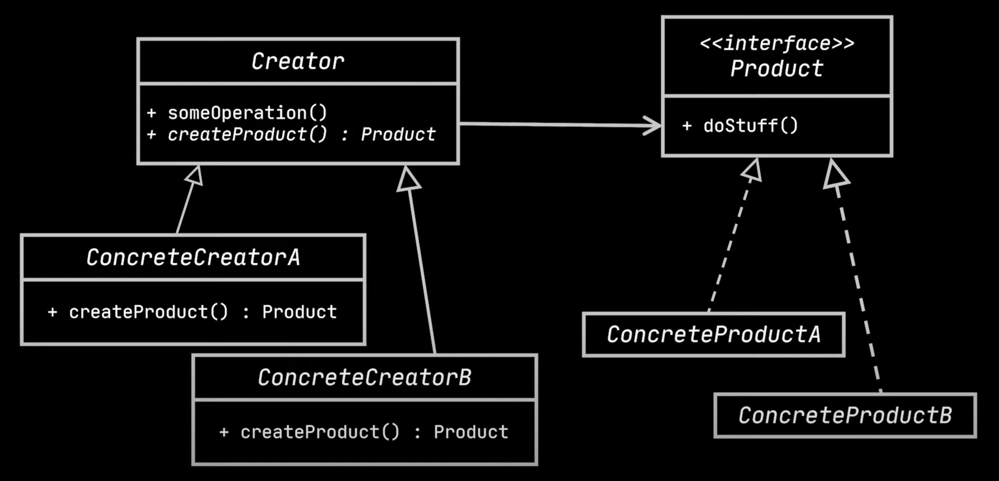

# Factory method design pattern
- Let's understand the need for arriving at factory design pattern.
- `Problem`
  - Let's take an example of a Restaurant class which creates chicken and veg burgers.

```java
class Restaurant{
    public Burger orderBurger(String type){
        if("chicken".equals(type)){
            var burger = new ChickenBurger();
            burger.prepare();
            return burger;
        } else if("vet".equals(type)){
            var burger = new VegBurger();
            burger.prepare();
            return burger;
        }
    }
}
```
- The above code works only when we have a base class `Burger` with sub-classes like ChickenBurger, VegBurger etc.
  - We can also extract common behaviors(productId, addOns) to the base class.

```java
abstract class Burger{
    private String productId;
    private List<String> addOns;
    void prepare();
}

class ChickenBurger extends Burger{
    void prepare(){
        System.out.println("Preparing chicken burger");
    }
}

class VegBurger extends Burger{
    void prepare(){
        System.out.println("Preparing chicken burger");
    }
}

```
- The above code looks complete, but when new types of burgers are required in the future, Restaurant class needs change. This 
  violates open/closed and single responsibility principles.
- Also, when some types of burgers are removed, again code needs to be modified.
- `Solution`
  - The solution for the above problem is to move burger creation code and encapsulate into a new class called a Factory.
- Here is the code of the factory and Restaurant classes.
```java
class BurgerFactory{
    public Burger createBurger(String type){
        var burger =  null;
        if("chicken".equals(type)){
            burger = new ChickenBurger();
        } else if("vet".equals(type)){
            burger = new VegBurger();
        }
        return burger;
    }
}

class Restaurant{
    public Burger orderBurger(String type){
        var burgerFactory = new BurgerFactory();
        var burger = burgerFactory.createBurger(type);
        burger.prepare();
        return burger;
    }
}
```
- The above design is called a simple factory idiom.
- This is an idiom that's commonly used and not a full fledged pattern.
- The Factory class still need modification if new types of burgers are required in the future.
- This is forms the basic understanding for `Factory method` design pattern.

## Factory method design pattern
- This pattern loosens the coupling of the given code by separating the product's construction code from the code that uses this 
  product.
- This pattern requires the following changes for the above class.
  - Let's make the Restaurant class abstract.
  - Let's create the factory method as an abstract method inside Restaurant class(createBurger() which was defined inside factory 
    class earlier).
  - Let's write concrete Restaurant classes and make them create burgers.
```java
abstract class Restaurant{
    public Burger orderBurger(){
        var burger = createBurger();
        burger.prepare();
        return burger;
    }

    abstract Burger createBurger();
}

class ChickenBurgerRestaurant{
    public Burger createBurger(){
        return new ChickenBuger();
    }
}

class VegBurgerRestaurant{
    public Burger createBurger(){
        return new VegBurger();
    }
}
```
- As shown above, the factory method design pattern relies on heritance. It delegates the creation of objects to sub-classes that implement the factory method.
- In a nut-shell factory method design pattern requires the following changes.
  - Create a product interface(like Burger) and implementation classes(like VegBurger and ChickenBurger).
  - Write Creator sub-classes(ChickenBurgerRestaurant, VegBurgerRestaurant) which decide the concrete class that needs to be initiated.
  - Write the creation code inside business logic(orderBurger() method) with the factory method.
- `Note:` orderBurger() method is no longer dependent on the request object, because the users of restaurant class can instantiate the 
  sub-classes directly. Here is the illustration of the client code.
```java
Restaurant restaurant = new ChickenBurgerRestaurant();
restaurant.orderBurger();

Restaurant vegRestaurant = new VegBurgerRestaurant();
vegRestaurant.orderBurger();
```
- Here is the UML class diagram of factory method design pattern.



- `Advantages`
  - Factory method pattern supports SRP, as it centralizes the product creation code into a separate hierarchy and also won't break 
    anything when new types are added and existing types are removed.

