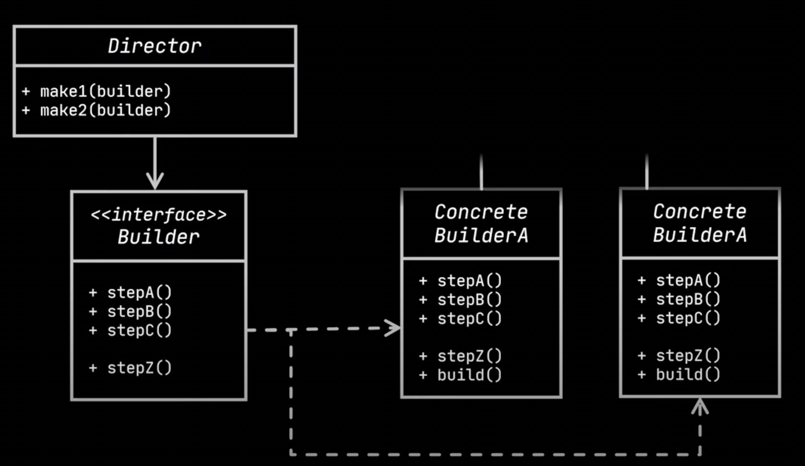

# Builder design pattern

- Builder design pattern allows different representations of an object using the same construction process.

## Need for builder

- Static factories and constructors share a limitation: they do not scale well to large numbers of optional parameters.
- Consider the case of a class representing the Nutrition Facts label that appears on packaged foods.
  - These labels have a few required fields like serving size, servings per container, and calories per serving and more than twenty 
    optional fields like total fat, saturated fat, trans fat, cholesterol, sodium, and so on.
- Here are various solutions for the problem
- `Telescoping constructor`
  - One solution to this is to use telescoping constructor pattern. This pattern provides a constructor with required parameters, 
    another with a single optional parameter, third with two optional parameters etc.
  - Here is the illustration of this.

```java    
public class NutritionFacts {
    private final int servingSize;  
    private final int servings;
    private final int calories;
    private final int fat;
    private final int sodium;
    private final int carbohydrate; // (g/serving)
    public NutritionFacts(int servingSize, int servings) {
        this(servingSize, servings, 0);
    }
    public NutritionFacts(int servingSize, int servings, int calories) {
        this(servingSize, servings, calories, 0);
    }

    public NutritionFacts(int servingSize, int servings, int calories, int fat) {
        this(servingSize, servings, calories, fat, 0);
    }

    public NutritionFacts(int servingSize, int servings, int calories, int fat, int sodium) {
        this(servingSize, servings, calories, fat, sodium, 0);
    }

    public NutritionFacts(int servingSize, int servings, int calories, int fat, int sodium, int carbohydrate) {
        this.servingSize  = servingSize;
        this.servings
        this.calories
        this.fat
        this.sodium
        this.carbohydrate = carbohydrate;
    }
}
```
- Typically this constructor invocation will require many parameters that you don’t want to set, but you’re forced to pass a value for 
  them anyway. For ex, 0 is passed for fat in this statement.

```java
   NutritionFacts cocaCola =new NutritionFacts(240, 8, 100, 0, 35, 27);
```
- In conclusion telescoping constructors has the following disadvantages.
  - The telescoping constructor pattern works, but it is hard to write client code when there are many parameters, and harder still to 
    read it.
  - Also, The reader is left wondering what all those values mean and must carefully count parameters to find out.

- `Javabeans`
  - This approach calls a parameterless constructor to create the object and then call setter methods to set each required parameter 
    and each optional parameter of interest.
  - This pattern has none of the disadvantages of the telescoping constructor pattern.  
  - `Disadvantages`
    - Because construction is split across multiple calls, a JavaBean may be in an inconsistent state partway through its construction.
    - A related disadvantage is that the JavaBeans pattern precludes the possibility of making a class immutable and requires added  
      effort on the part of the programmer to ensure thread safety.
- The third alternative that combines the safety of the telescoping constructor pattern with the readability of the JavaBeans pattern.
  This pattern is the builder design pattern.

## How to create  

- Instead of making the desired object directly, the client calls a constructor (or static factory) with all of the required 
  parameters and gets a builder object. 
- Then the client calls setter-like methods on the builder object to set each optional parameter of interest. 
- Finally, the client calls a parameterless build method to generate the object, which is typically immutable. 
```java
public class NutritionFacts {
    private final int servingSize;
    private final int servings;
    private final int calories;
    private final int fat;
    private final int sodium;
    private final int carbohydrate;
    public static class Builder {
        // Required parameters
        private final int servingSize;
        private final int servings;
        // Optional parameters - initialized to default values
        private int calories
        private int fat
        private int sodium
        private int carbohydrate  = 0;
        public Builder(int servingSize, int servings) {
            this.servingSize = servingSize;
            this.servings    = servings;
        }
        public Builder calories(int val) {
            calories = val;
            return this;
        }
        public Builder fat(int val) {
            fat = val;
            return this;
        }
        public Builder sodium(int val) {
            sodium = val;
            return this;
        }
        public Builder carbohydrate(int val) {
            carbohydrate = val;
            return this;
        }
        public NutritionFacts build() {
            return new NutritionFacts(this);
        } 
    }
    private NutritionFacts(Builder builder) {
        servingSize  = builder.servingSize;
        servings = builder.servings;
        calories = builder.calories;
        fat = builder.fat;
        sodium = builder.sodium;
        carbohydrate = builder.carbohydrate;
    }
}
```
- The builder is typically a static member class of the class it builds. 
- `Advantages`
    - The NutritionFacts class is immutable, and all parameter default values are in one place.
    - The builder’s setter methods return the builder itself so that invocations can be chained, resulting in a fluent API.
    - Here’s how the client code looks:
```java    
NutritionFacts cocaCola = new NutritionFacts.Builder(240, 8)
                            .calories(100)
                            .sodium(35)
                            .carbohydrate(27)
                            .build();
```

## Builder design pattern

- The builder design pattern uses the builder pattern we have seen above.
- If we have to create multiple builder objects, many of them might share some common properties.
- Let's take the below example of Car and CarBuilder.
```java
class Car {

    private final int id;
    private final int height;
    private final String brand;
    private final String model;
    private final String color;
    private final String engine;
    private final int nbrOfDoors;

    Car(int id, String brand, String model, String color, int height, String engine, int nbrOfDoors) {
        this.id = id;
        this.brand = brand;
        this.model = model;
        this.color = color;
        this.height = height;
        this.engine = engine;
        this.nbrOfDoors = nbrOfDoors;
    }

    public class static CarBuilder {
        private int id;
        private int height;
        private String brand;
        private String model;
        private String color;
        private String engine;
        private int nbrOfDoors;

        public CarBuilder id(int id) {
            this.id = id;
            return this;
        }

        public CarBuilder brand(String brand) {
            this.brand = brand;
            return this;
        }

        public CarBuilder model(String model) {
            this.model = model;
            return this;
        }

        public CarBuilder color(String color) {
            this.color = color;
            return this;
        }

        public CarBuilder height(int height) {
            this.height = height;
            return this;
        }

        public CarBuilder engine(String engine) {
            this.engine = engine;
            return this;
        }

        public CarBuilder nbrOfDoors(int nbrOfDoors) {
            this.nbrOfDoors = nbrOfDoors;
            return this;
        }

        public Car build() {
            return new Car(id, brand, model, color, height, engine, nbrOfDoors);
        }
    }
}
```
- Let's create several instances of car class using the builder.
```java
Car car = new CarBuilder()
            .id(2122)
            .brand("Buggati")
            .color("Blue")
            .nbrOfDoors(2)
            .engine("8L")
            .height(115);

Car car2 = new CarBuilder()
            .id(2123)
            .brand("Buggati")
            .color("Blue")
            .nbrOfDoors(2)
            .engine("8L")
            .height(115);

Car car3 = new CarBuilder()
            .id(2124)
            .brand("Lamborghini")
            .color("Red")
            .nbrOfDoors(2)
            .engine("6.5L")
            .height(120);

Car car4 = new CarBuilder()
            .id(2125)
            .brand("Lamborghini")
            .color("Red")
            .nbrOfDoors(2)
            .engine("6.5L")
            .height(120);
```
- From the above we can see that certain similarirties between different kinds of objects. For ex, all buggati cars use same engine 
  and color.
- Builder pattern suggests that all the repeated code(steps for building) should be extracted to a seperate class called `Director`.
- Director class defines the order of the construction steps to reuse specific specific configurations as shown below.
```java
public class Director {
    public void buildBugatti(Builder builder) {
        builder.brand("Bugatti")
                .color("Blue")
                .nbrOfDoors(2)
                .engine("8L")
                .height(115);
    }

    public void buildLambo(Builder builder) {
        builder.brand("Lamborghini")
                .color("Red")
                .engine("6.5L")
                .height(120);
    }
}
```
- The above director class can be reused across various parts of the application to reduce the duplicate code.
- The director class hides the details of the object construction from the client code.
- Now creation object becomes much simpler as shown below.
```java
    CarBuilder builder = new CarBuilder();
    director.buildBugatti(builder);
    builder.model("Chiron");
    System.out.println(builder.build());
```

- `Advantage of Director`
- The directors give flexibility in dealing with various builder implementations.
- Let's consider an example of Car and CarSchema classes.
  - Both Car and CarSchema has same fields.
  - As Car and CarSchema are not same, we cannot use inheritance to build both Car and CarSchema using the the director.
  - So CarSchema will have its own builder, lets say CarSchemaBuilder.
  - Though we cannot use inheritance, we can extract both CarBuilder and CarSchemaBuilder to make use of a common Builder.
  - The director class code can be reused for both Car and CarSchema.
  - Here is the illustration of this.
```java
interface Builder {
    Builder id(int id);
    Builder brand(String brand);
    Builder model(String model);
    Builder color(String color);
    Builder height(int height);
    Builder engine(String engine);
    Builder nbrOfDoors(int nbrOfDoors) ;
}

class CarBuilder implements Builder {
    private int id;
    private int height;
    private String brand;
    private String model;
    private String color;
    private String engine;
    private int nbrOfDoors;

    @Override
    public CarBuilder id(int id) {
        this.id = id;
        return this;
    }

    @Override
    public CarBuilder brand(String brand) {
        this.brand = brand;
        return this;
    }

    @Override
    public CarBuilder model(String model) {
        this.model = model;
        return this;
    }

    @Override
    public CarBuilder color(String color) {
        this.color = color;
        return this;
    }

    @Override
    public CarBuilder height(int height) {
        this.height = height;
        return this;
    }

    @Override
    public CarBuilder engine(String engine) {
        this.engine = engine;
        return this;
    }

    @Override
    public CarBuilder nbrOfDoors(int nbrOfDoors) {
        this.nbrOfDoors = nbrOfDoors;
        return this;
    }

    public Car build() {
        return new Car(id, brand, model, color, height, engine, nbrOfDoors);
    }
}

class CarSchemaBuilder implements Builder {
    private int id;
    private int height;
    private String brand;
    private String model;
    private String color;
    private String engine;
    private int nbrOfDoors;

    @Override
    public CarSchemaBuilder id(int id) {
        this.id = id;
        return this;
    }

    @Override
    public CarSchemaBuilder brand(String brand) {
        this.brand = brand;
        return this;
    }

    @Override
    public CarSchemaBuilder model(String model) {
        this.model = model;
        return this;
    }

    @Override
    public CarSchemaBuilder color(String color) {
        this.color = color;
        return this;
    }

    @Override
    public CarSchemaBuilder height(int height) {
        this.height = height;
        return this;
    }

    @Override
    public CarSchemaBuilder engine(String engine) {
        this.engine = engine;
        return this;
    }

    @Override
    public CarSchemaBuilder nbrOfDoors(int nbrOfDoors) {
        this.nbrOfDoors = nbrOfDoors;
        return this;
    }

    public CarSchema build() {
        return new CarSchema(id, brand, model, color, height, engine, nbrOfDoors);
    }
}

public class Director {
    // This builder construction process can be reused for both Car and CarSchema
    public void buildBugatti(Builder builder) {
        builder.brand("Bugatti")
                .color("Blue")
                .nbrOfDoors(2)
                .engine("8L")
                .height(115);
    }

    public void buildLambo(Builder builder) {
        builder.brand("Lamborghini")
                .color("Red")
                .engine("6.5L")
                .height(120);
    }
}
```
- Here is the UML class diagram of the builder design pattern.



- `Director` corresponds to the Director class in our example.
- `Builder` corresponds to the Builder interface in our example.
- `ProductA` and `ProductB` represents Car and CarSchema.
- `ConcreteBuilderA` and `ConcretedBuilderB` represents CarBuilder and CarSchemaBuilder.

## Summary
- The builder pattern seperates the constructions of an object from its representation.
- It requires to create a builder class containing the same fields of the object.
  - The builder class provides setter-methods and a build method for creating the object.
- If the client code requires to create several objects with several repeated steps, extract them to a director.
  - Directors encapsulate various ways to construct a product using the same builder object.   
