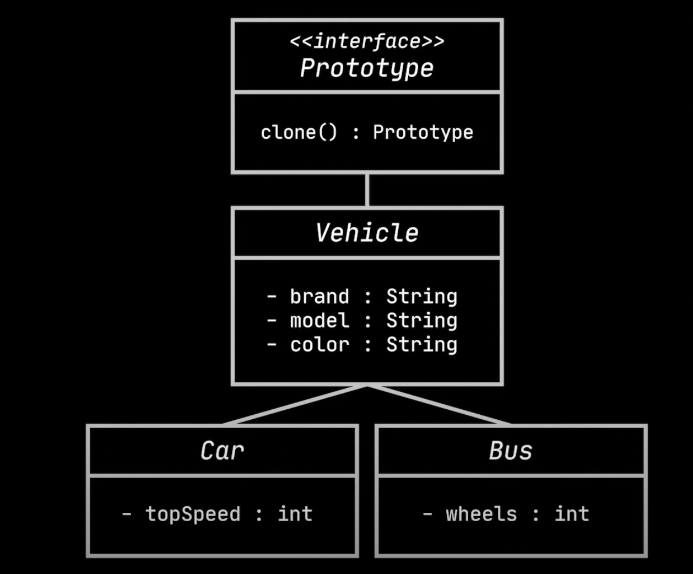

# Prototype design pattern

- Prototype design pattern is about creating copies of an object.
- Let's imagine a Car class with few fields as shown below.
```java
class Car{
    String brand;
    String model;
    String car;
    int topSpeed;
}
```
- Copying an exact copy of an object requires the below code.
```java
var carA = new Car();
carA.setBrand("Buggati");
carA.setModel("Chiron");
carA.setColor("Blue");
carA.setTopSpeed(270);

var carB = new Car();
carB.setBrand(carA.getBrand());
carB.setModel(carA.getModel());
carB.setColor(carA.getColor());
carB.setTopSpeed(carA.getTopSpeed());
```
- `Problems`
  - The above approach won't work especially when some fields are private because they are not visible from outside.
  - The copying is tightly dependent on the Car class. This is an issue when we work with third party applications. Because most of 
    the third party applications return an interface/abstract class type, rather than concrete class.
- The solution for the above problem is prototype design pattern.
- The prototype design pattern delegates the cloning process to the actual objects that are being cloned.
- `How it works`
  - To apply prototype design pattern, declare a common interface for all objects that declare cloning.
  - Usually, such an interface contains a single method, lets say clone(), whose purpose is to create a new object and copies values 
    from old object to new object. Here is the illustration of the same.
- `Advantages`
  - Decouples the creation logic from the application code(Moved to the class being copied).
  - Able to clone the private fields because the fields and clone belong to the same class.
  - The users of the application can create a copy of the object that implements the prototype interface.
- If the hierarchy has a generic class like Vehicle which is extended by say Car, Bus etc, the clone() method can be defined in the 
  generic class(Vehicle in this case).
  - This hierarchy gives the real power as the client code doesn't need to know exact type for cloning. Here is the complete code.
```java
public void cloneList(){
    List<Vehicle> copyList = new ArrayList<>();
    for(Vehicle vehicle: vehicles){
        copyList.add(vehicle.clone());
    }
}

abstract class Vehicle {

    private final String brand;
    private final String model;
    private final String color;

    public Vehicle(String brand, String model, String color) {
        this.brand = brand;
        this.model = model;
        this.color = color;
    }

    protected Vehicle(Vehicle vehicle) {
        this.brand = vehicle.brand;
        this.model = vehicle.model;
        this.color = vehicle.color;
    }

    public abstract Vehicle clone();
}

class Bus extends Vehicle {
    private final int doors;

    public Bus(String brand, String model, String color, int doors) {
        super(brand, model, color);
        this.doors = doors;
    }

    private Bus(Bus bus) {
        super(bus);
        this.doors = bus.doors;
    }

    @Override
    public Bus clone() {
        return new Bus(this);
    }
}

class Car extends Vehicle {
    private final int topSpeed;

    public Car(String brand, String model, String color, int topSpeed) {
        super(brand, model, color);
        this.topSpeed = topSpeed;
    }

    private Car(Car car) {
        super(car);
        this.topSpeed = car.topSpeed;
    }

    @Override
    public Car clone() {
        return new Car(this);
    }
}
```
- This pattern requires a copy constructor that takes the arugment of the same type and instantiates fields that belong to the class.
- The clone() method has a single statement, which calls the copy constructor of the same class.
- `Note:` If the concrete sub-classes needs to support then override them as shown above, otherwise they can ignore.

## `Shallow and Deep copy`

- Let's see the below example to understand shallow-copy.

```java
class Car extends Vehicle {
    private final int topSpeed;
    private final GpsSystem gpsSystem;

    public Car(String brand, String model, String color, int topSpeed) {
        super(brand, model, color);
        this.topSpeed = topSpeed;
    }

    private Car(Car car) {
        super(car);
        this.topSpeed = car.topSpeed;
        this.gpsSystem = car.gpsSystem;
    }

    @Override
    public Car clone() {
        return new Car(this);
    }
}

class GpsSystem{
}

// Test code
Car car = new Car("Buggati", "chiron", 270);
GpsSystem gpsSystem = new GpsSystem();
car.setGpsSystem(gpsSystem);
Car clonedCar = car.clone();
```
- The above car and clonedCar objects refer to the same gpsSystem object. This is called a shallow copy.
- To make a deep-copy, the copy constructor code of Car should either create a new object or let GpsSystem class implement clone() 
  method using prototype pattern and return the new object.

- Here is the UML class diagram of prototype design pattern.



- `Prototype Registry`
  - This is a centralized catalog for the prototypes that gets created for the application.
  - This stores the most frequently access prototypes.
  - This stoes a set of pre-build objects that are ready to be copied.
  - The simplest registry are caches like hash maps like a factory.
  - when application code queries the cache, it is retrieved, cloned and returned.
```java
class VehicleCache {
    private final Map<String, Vehicle> cache = new HashMap<>();

    public VehicleCache() {
        Car car = new Car("Bugatti", "Chiron", "Blue", 261);
        Bus bus = new Bus("Mercedes", "Setra", "White", 48);

        cache.put("Bugatti Chiron", car);
        cache.put("Mercedes Setra", bus);
    }

    public Vehicle get(String key) {
        return cache.get(key).clone();
    }

    public void put(List<Vehicle> vehicles) {
        vehicles.forEach(vehicle -> cache.put(vehicle.getBrand() + " " + vehicle.getModel(), vehicle));
    }
}

class MainApp {
    /*
     * Video Reference: https://youtu.be/DcFhITC9v0E
     */
    public static void main(String[] args) {
        List<Vehicle> vehicles = List.of(
                new Car("car_brand", "car_model", "car_color", 300),
                new Bus("bus_brand", "bus_model", "bus_color", 8)
        );

        List<Vehicle> copyList = new ArrayList<>();
        for (Vehicle vehicle : vehicles) {
            copyList.add(vehicle.clone());
        }

        copyList.forEach(System.out::println);

        System.out.println("==========================================");

        VehicleCache registry = new VehicleCache();
        registry.put(vehicles);
        System.out.println(registry.get("car_brand car_model"));
    }
}
```
- `When to use`
  - Use prototype pattern when code shouldn't depend on concrete classes of the objects that need to be copied.
  - Use prototype when constructing a new object is expensive.
