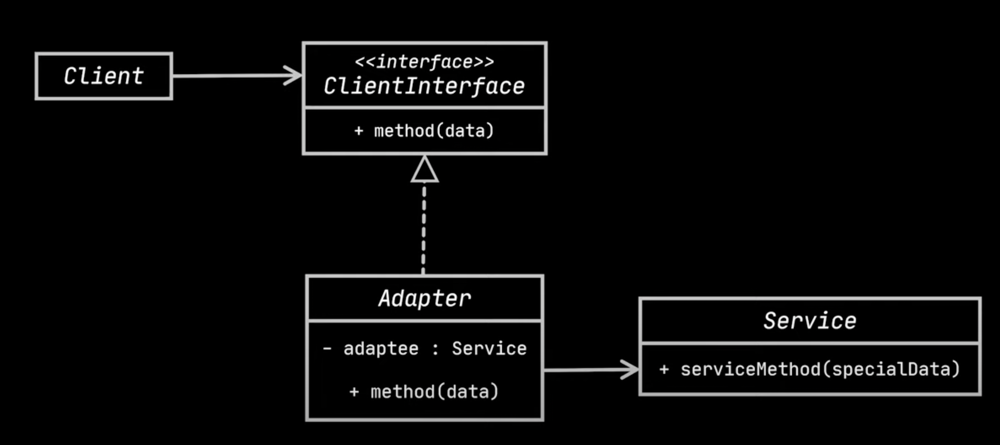

# Adapter design pattern

- The adapter design pattern is a strcutural design-pattern that allows objects with incompatible interfaces to collaborate with one 
  another.
- `Usecase`
  - A food delivery app like zomato which collects menu of several restaurants and combine them into a single delivery platform.
  - This app collects data from multiple sources in xml format and using them to display menus and recommondations in the UI.
  - The app requires an upgrade to the UI and there is a thrid party library that has all fancy ui components but it works only with 
    json data.
- `Problem`
  - The third party library code may not be available and unable to change the source code.
- `Solution`
  - The adapater design pattern provides solution to the problem.
  - The adapter takes xml data and transforms to json.
```java
interface IDevelieryApp{
    void displayMenus(XMLData xmlData);
    void displayRecommondations(XMLData xmlData);
}

class DevelieryApp extends IDevelieryApp{
    @Override
    void displayMenus(XMLData xmlData){
        // display menus using xml data
    }

    @Override
    void displayRecommondations(XMLData xmlData){
        // display recommondations using xml data
    }
}

// Third party library
class FancyUIService{
    void displayMenus(Jsondata jsondata){
        // display menus using json data
    }

    void displayRecommondations(Jsondata jsondata){
        // display recommondations using json data
    }
}
```
- To transform xml data to json data we need an adapter.
- This adapter uses both inheritance(or realization) and composition.
- The adapater implements the IDeliveryApp interface and wraps the FancyUIService class.
```java
class FancyUIServiceAdapter implements IDevelieryApp{
    private final FancyUIService fancyUIService;
    FancyUIServiceAdapter(){
        fancyUIService = new FancyUIService();
    }

    @Override
    void displayMenus(XMLData xmlData){
        JsonData jsonData = convertXMLToJson(xmlData);
        fancyUIService.displayMenus(jsonData);
    }

    @Override
    void displayRecommondations(XMLData xmlData){
        JsonData jsonData = convertXMLToJson(xmlData);
        fancyUIService.displayRecommondations(jsonData);
    }
}

// Client code
IDevelieryApp deliveryApp = new DevelieryApp();
deliveryApp.displayMenus(new XmlData());

FancyUIServiceAdapter adapter = new FancyUIServiceAdapter();
adapter.displayMenus(new XmlData());
```
- Here is the UML class diagram of adapter design pattern.



- `Client`
  - The client contains the business logic of the app.
- `ClientInterface`
  - It contains methods to be implemented by that other classes and adapter.  
- `Service`
  - It is some legacy or third-party code that client can't use directly because it has some incompatible interface.
- `Adapter`
  - It contains the logic and can be able to work with both client and legacy code.
  - It implements the Client interface.
      