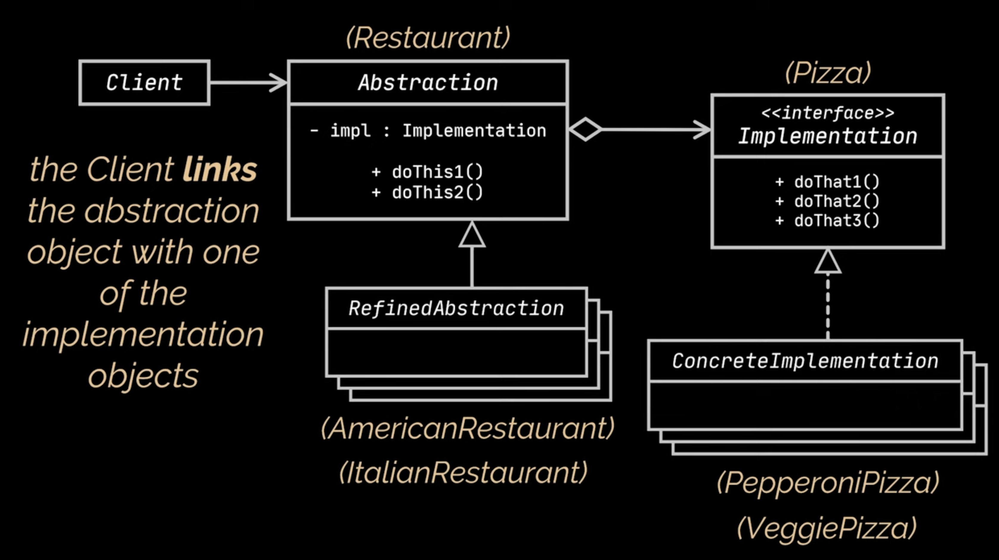

# Bridge design pattern
- The Bridge pattern is used to decouple an abstraction from its implementation so that the two can vary independently.
- `Problem`
  - Let's imagine a pizza delivery business that prepares and delivers different implementations of pizzas.

```java
abstract class Pizza {
    protected String sauce;
    protected String toppings;
    protected String crust;
    public abstract void prepareAndDeliver();
}

class PepperoniPizza extends Pizza{
    @Override
    public void prepareAndDeliver(){
        System.out.println("Adding sauce");
        System.out.println("Adding pepperoni toppings");
        System.out.println("Adding crust");
        System.out.println("Order in progress");
    }
}

class VegPizza extends Pizza{
    @Override
    public void prepareAndDeliver(){
        System.out.println("Adding sauce");
        System.out.println("Adding veg toppings");
        System.out.println("Adding crust");
        System.out.println("Order in progress");
    }
}
```
  - To extend this pizza delivery for both american and italian restaurants we require 4 sub-types of pizza as shown below.
```java
class ItalianRestaurantPepperoniPizza extends Pizza{
    @Override
    public void prepareAndDeliver(){
        System.out.println("Adding sauce");
        System.out.println("Adding italian pepperoni toppings");
        System.out.println("Adding crust");
        System.out.println("Order in progress");
    }
}

class ItalianRestuarantVegPizza extends Pizza{
    @Override
    public void prepareAndDeliver(){
        System.out.println("Adding sauce");
        System.out.println("Adding italian veg toppings");
        System.out.println("Adding crust");
        System.out.println("Order in progress");
    }
}

class AmericanRestaurantPepperoniPizza extends Pizza{
    @Override
    public void prepareAndDeliver(){
        System.out.println("Adding sauce");
        System.out.println("Adding american pepperoni toppings");
        System.out.println("Adding crust");
        System.out.println("Order in progress");
    }
}

class AmericanRestaurantVegPizza extends Pizza{
    @Override
    public void prepareAndDeliver(){
        System.out.println("Adding sauce");
        System.out.println("Adding american veg toppings");
        System.out.println("Adding crust");
        System.out.println("Order in progress");
    }
}
```
- Adding new pizza types and ways of preparing them grows exponentially. For ex, to introduce chicken pizza, two new sub-classes 
  AmericanChickenPizzaDelivery and ItalianChickenPizzaDelivery need to be implemented.
- `Note:` This problem has occurred because we are trying extend pizza delivery in two independent dimensions like type(pepperoni/veg) and preparation(assembling styles like american, italian).
- This is the most common problem with inheritance.
- `Solution`
  - To solve the problem we should go with composition instead of inheritance.
  - It means extract one of the dimensions into a sepeate class hierarchy, so that original classes will reference to the object of new hierarchy instead of having all of its state and behaviors with in one class.
```java
abstract class Pizza {
    protected String sauce;
    protected String toppings;
    protected String crust;

    public void setSauce(String sauce){
        this.sauce = sauce;
    }
    public String getSauce(){
        return this.sauce;
    }
    //other setters and getters ommitted for brevity
    public abstract void prepare();
}

class PepperoniPizza extends Pizza{
    @Override
    public void prepare(){
        System.out.println("Adding sauce" + sauce);
        System.out.println("Adding pepperoni toppings" + toppings);
        System.out.println("Adding crust" + crust);
    }
}

class VegPizza extends Pizza{
    @Override
    public void prepare(){
        System.out.println("Adding sauce" + sauce);
        System.out.println("Adding veg toppings" + toppings);
        System.out.println("Adding crust" + crust);
    }
}
```
- Note the above class hierachy represents abstractions. Abstraction doesn't mean java abstract class here. It represents different 
  types.  
- Here is the code for various implementations like American, Italian etc.
```java
abstract class Restaurant {
    protected Pizza pizza;
    protected Restaurant(Pizza pizza) {
        this.pizza = pizza;
    }

    abstract void addSauce();
    abstract void addToppings();
    abstract void makeCrust();

    public void deliver() {
        makeCrust();
        addSauce();
        addToppings();
        pizza.assemble();
        pizza.qualityCheck();
        System.out.println("Order in Progress!");
    }
}

class AmericanRestaurant extends Restaurant {
    public AmericanRestaurant(Pizza pizza) {
        super(pizza);
    }

    @Override
    public void addToppings() {
        pizza.setToppings("Everything");
    }

    @Override
    public void addSauce() {
        pizza.setSauce("Super Secret Recipe");
    }

    @Override
    public void makeCrust() {
        pizza.setCrust("Thick");
    }
}

class ItalianRestaurant extends Restaurant {
    public ItalianRestaurant(Pizza pizza) {
        super(pizza);
    }

    @Override
    public void addToppings() {
        pizza.setToppings("-");
    }

    @Override
    public void addSauce() {
        pizza.setSauce("Oil");
    }

    @Override
    public void makeCrust() {
        pizza.setCrust("Thin");
    }
}

class Test {
    /*
     * Video Reference: https://youtu.be/88kAIisOiYs
     */
    public static void main(String[] args) {
        Restaurant americanRestaurant = new AmericanRestaurant(new PepperoniPizza());
        americanRestaurant.deliver();
        System.out.println("==========================================");
        Restaurant italianRestaurant = new ItalianRestaurant(new VeggiePizza());
        italianRestaurant.deliver();
    }
}
```
- The `Pizza` reference added in `Restaurant` class hierarchy acts as a bridge between them.
- `Note:` Adding new pizzas won't require changing the restaurant hierarchy and vice versa.
- This gives flexibility to choose between restaurant types and restaurants.
- The bridge pattern splits a large class into two seperate hierarchies which can be developed independently.
- As per GOF, these two types are referred as abstraction and implementation respectively. 
  - The abstraction layer is a high-level control layer(restaurant), it should delegate the work to the implementation layer(pizza).
- Here is the UML class diagram for bridge design pattern.



- `Advantages`
  - Bridge design pattern divides and organizes a single class that has multiple variants of some functionality into two hierarchies: 
    abstraction and implementation.
  - The client code won't be exposed to implementation details.
  - This promotes SRP. 
  - This also promotes open/closed principle as new abstractions and implementations are added independently.
