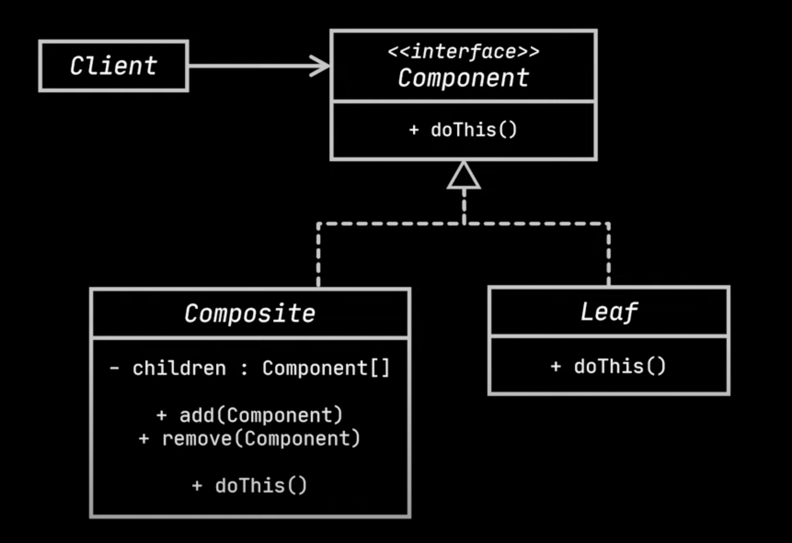

# Composite design pattern

- Let's discuss a business problem to understand the need of Composite design pattern.
- Let's take the business case of an e-commerce delivery system.
  - This delivery system contains two types of objects, say box and product.
    - A box can contain products or(and) no of smaller boxes.
  - The delivery system needs to calculate the total price of all products with in a box.
  - The solution for the problem can be achieved through iterating all boxes as shown in the below code.
```java
class Box{
    private List<Box> boxes;
    private List<Product> products;

    public double calculatePrice(){
        double sum = products.stream()
                        .mapToDouble(Productt::getPrice)
                        .sum();
        for(var box: boxes){
            // This is a kind of recursive call
            sum = sum + box.calculatePrice();
        }
        return sum;                
    }
}
class Product{
    private String title;
    private String price;
}

// Test
public static void main(String[] args){
    var smallBox1 = new Box(emptyList(), List.of(new Product("1", 100), new Product("2", 100), new Product("3", 100)));
    var smallBox2 = new Box(emptyList(), List.of(new Product("4", 200), new Product("5", 200), new Product("6", 200)));
    var product1 = new Product("7", 100);
    var product2 = new Product("8", 100);
    var box = new Box(List.of(smallBox1, smallBox2), List.of(product1, product2));
    System.out.println(box.calculatePrice())
}
```
- `Problem`
  - Although, the above solution looks good, they are not viable in all cases. For ex, if we want to add packaging cost for each box, 
    the above solution won't work. This requires a code change the calcuation logic.
- `Solution`
  - The solution for the above problem is the composite design pattern.
  - The composite design pattern allows to composes objects into tree structures and work with them as if they were individual objects.
  - Using composite design pattern only makes sense when the model and object's structures of our application can be represented as a 
    tree.
- `Implementation`
  - To implement this design pattern for the above problem, the following steps are required.
    - Create a `CompositeBox` class whose only purpose is to store multiple other boxes.
    - Create a hierarchy of products let's say `Book`, `VideoGame` implement the same interface say `Box`.
    - The interface `Box` contains only a method to calculate total price.
    - In the concrete product classes this method is implemented.
    - The `CompositeBox` also implements `Box` and it's code iterates through all child boxes and calculate price.
    - Please see the below code for the above illustration.
 ```java
interface Box {
    double calculatePrice();
}

class CompositeBox implements Box {
    private final List<Box> children = new ArrayList<>();

    public CompositeBox(Box... boxes) {
        children.addAll(Arrays.asList(boxes));
    }

    @Override
    public double calculatePrice() {
        return children
                .stream()
                .mapToDouble(Box::calculatePrice)
                .sum();
    }
}

abstract class Product implements Box {
    protected final String title;
    protected final double price;
}

class Book extends Product {
    public Book(String title, double price) {
        super(title, price);
    }

    @Override
    public double calculatePrice() {
        return getPrice();
    }
}

class VideoGame extends Product {
    public VideoGame(String title, double price) {
        super(title, price);
    }

    @Override
    public double calculatePrice() {
        return getPrice();
    }
}
```
- The greatest benefits of this is that the composite box doesn't need to care about the concrete objects(products) of the classes 
  that composes the tree. They are all treated same, because they are all boxes(implement box interface). Refer the calculatePrice() of CompositeBox class.
- Here is the client code.
```java
class DeliveryService {
   private Box box;

    public DeliveryService() {
    }

    public void setupOrder(Box... boxes) {
        this.box = new CompositeBox(boxes);
    }

    public double calculateOrderPrice() {
        return box.calculatePrice();
    }
}

// Test code

public static void main(String[] args) {
        DeliveryService deliveryService = new DeliveryService();
        deliveryService.setupOrder(
                new CompositeBox(
                        new VideoGame("1", 100)
                ),
                new CompositeBox(
                        new CompositeBox(
                                new Book("2", 200),
                                new Book("3", 300)
                        ),
                        new VideoGame("4", 400),
                        new VideoGame("5", 500)
                )
        );
        System.out.println(deliveryService.calculateOrderPrice());
    }
```  

- Here is the UML class diagram for the bridge composite design pattern.

